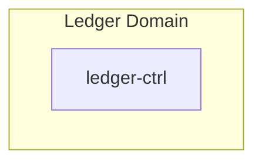
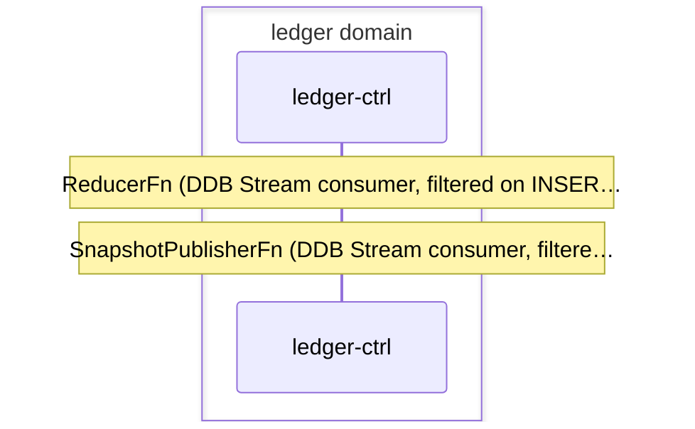

# Order Ledger

> Order fill events from execution domain recorded as ledger entries, balance and portfolio snapshots materialized via event-sourced reducer, forwarded cross-domain to investor and advisory

**Domains:** execution, ledger, investor, advisory

**Trigger:** ORDER_FILLED (or ORDER_PARTIALLY_FILLED) emitted by execution domain on ExecutionBus

## Flowchart

## Sequence Diagram

## Steps

### Step 1: Cross-domain hop

- **Event:** `ORDER_FILLED`
- **From:** ExecutionBus
- **To:** LedgerBus
- **Via:** ledger-adpt EB rule (LedgerIngress-FromExecution)

### Step 2: Cross-domain hop

- **Event:** `ORDER_PARTIALLY_FILLED`
- **From:** ExecutionBus
- **To:** LedgerBus
- **Via:** ledger-adpt EB rule (LedgerIngress-FromExecution)

### Step 3: Cross-domain hop

- **Event:** `ORDER_REJECTED`
- **From:** ExecutionBus
- **To:** LedgerBus
- **Via:** ledger-adpt EB rule (LedgerIngress-FromExecution)

### Step 4: Cross-domain hop

- **Event:** `ORDER_CANCELLED`
- **From:** ExecutionBus
- **To:** LedgerBus
- **Via:** ledger-adpt EB rule (LedgerIngress-FromExecution)

### Step 5: ledger-ctrl

- **Receives:** `ORDER_FILLED | ORDER_PARTIALLY_FILLED | ORDER_REJECTED | ORDER_CANCELLED`
- **Via:** LedgerBus -> SQS -> ledger-ctrl-ingress
- **State change:** Writes LedgerEntry record (__typename LedgerEntry) to DDB with sequenceNo; for ORDER_FILLED with live executionMode also opens/closes tax lots via TaxLotManager
- **Emits:** `none (state change only; LedgerEntry:INSERT triggers reducer via DDB Stream)`
- **Idempotent:** yes

### Step 6: ledger-ctrl

- **Action:** ReducerFn (DDB Stream consumer, filtered on INSERT where __typename = LedgerEntry)
- **State change:** Replays entries since last checkpoint via accountReducer (RecordFill updates positions + cashBalanceCents); saveSnapshot writes AccountSnapshot (Snapshot#latest) + AccountCheckpoint with optimistic version lock
- **Emits:** `none (AccountSnapshot INSERT/MODIFY triggers SnapshotPublisherFn via DDB Stream)`
- **Idempotent:** yes

### Step 7: ledger-ctrl

- **Action:** SnapshotPublisherFn (DDB Stream consumer, filtered on INSERT and MODIFY where __typename = AccountSnapshot)
- **State change:** snapshotToEvents writes BalanceEvent (if cashBalanceCents changed), PortfolioEvent (if positions changed), LedgerEntryEvent (always), and TTL'd SnapshotHistory — as independent record() intents, not one transaction
- **Emits:** `BALANCE_UPDATED (CDC from BalanceEvent:INSERT), PORTFOLIO_UPDATED (CDC from PortfolioEvent:INSERT), LEDGER_ENTRY_RECORDED (CDC from LedgerEntryEvent:INSERT)`
- **Idempotent:** yes

### Step 8: Cross-domain hop

- **Event:** `BALANCE_UPDATED`
- **From:** LedgerBus
- **To:** InvestorBus
- **Via:** investor-adpt EB rule (InvestorIngress-FromLedger)

### Step 9: Cross-domain hop

- **Event:** `PORTFOLIO_UPDATED`
- **From:** LedgerBus
- **To:** InvestorBus
- **Via:** investor-adpt EB rule (InvestorIngress-FromLedger)

### Step 10: Cross-domain hop

- **Event:** `LEDGER_ENTRY_RECORDED`
- **From:** LedgerBus
- **To:** InvestorBus
- **Via:** investor-adpt EB rule (InvestorIngress-FromLedger)

### Step 11: Cross-domain hop

- **Event:** `PORTFOLIO_UPDATED`
- **From:** LedgerBus
- **To:** AdvisoryBus
- **Via:** advisory-adpt EB rule (AdvisoryIngress-FromLedger)

## Success Criteria

- Every ORDER_FILLED event produces a LedgerEntry, which triggers reducer to update AccountSnapshot
- Balance changes emit BALANCE_UPDATED; position changes emit PORTFOLIO_UPDATED; all entries emit LEDGER_ENTRY_RECORDED
- Investor domain receives BALANCE_UPDATED, PORTFOLIO_UPDATED, and LEDGER_ENTRY_RECORDED for portfolio display
- Advisory domain receives PORTFOLIO_UPDATED for drift detection and rebalancing triggers
- [object Object]
- [object Object]
- [object Object]

## Failure Modes

- **Ingestion handler fails:** LEDGER_PROCESSING_FAILED error event emitted to LedgerBus (direct EB); SQS retries + DLQ
- **Reducer snapshot conflict:** optimistic concurrency on snapshot version; DDB Stream retries (bisectBatchOnError, 3 retries)
- **CDC Egress fails:** DLQ on Egress Lambda; BalanceEvent/PortfolioEvent/LedgerEntryEvent records persist regardless
- **Cross-domain forwarding fails:** adapter DLQs (FromExecutionDLQ on ledger-adpt, FromLedgerDLQ on investor-adpt and advisory-adpt) with 14-day retention
- **LEDGER_PROCESSING_FAILED forwarding fails:** investor-adpt FromLedgerDLQ (14-day retention)
- **Snapshot publisher fails:** LEDGER_SNAPSHOT_PUBLISHER_FAILED error event emitted to LedgerBus (direct EB); DDB Stream retries (bisectBatchOnError, 3 retries); event is terminal on LedgerBus (not forwarded cross-domain)
