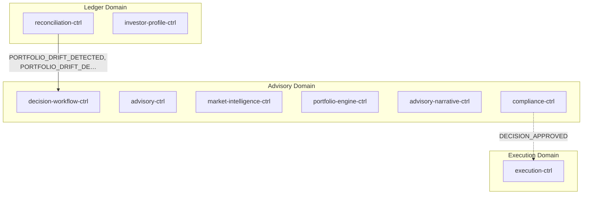
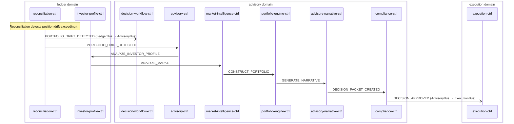

# Portfolio Rebalance

> Portfolio drift detected by reconciliation-ctrl triggers advisory decision cycle which produces rebalance orders

**Domains:** ledger, advisory, execution

**Trigger:** reconciliation-ctrl emits PORTFOLIO_DRIFT_DETECTED (CDC from DriftRecord insert)

## Flowchart

## Sequence Diagram

## Steps

### Step 1: reconciliation-ctrl

- **Action:** Reconciliation detects position drift exceeding threshold
- **State change:** Writes DriftRecord to DDB (tenantId, instrument, intentQty, settlementQty, drift)
- **Emits:** `PORTFOLIO_DRIFT_DETECTED (CDC from DriftRecord insert)`
- **Idempotent:** yes

### Step 2: Cross-domain hop

- **Event:** `PORTFOLIO_DRIFT_DETECTED`
- **From:** LedgerBus
- **To:** AdvisoryBus
- **Via:** advisory-adpt EB rule (AdvisoryIngress-FromLedger, DLQ FromLedgerDLQ 14d)

### Step 3: decision-workflow-ctrl

- **Receives:** `PORTFOLIO_DRIFT_DETECTED`
- **Via:** AdvisoryBus → SQS → decision-workflow-ctrl-trigger-ingress
- **State change:** Writes WorkflowTrigger record (tenantId, decisionId, trigger, triggerEventId, context)
- **Emits:** `WORKFLOW_TRIGGER (CDC from WorkflowTrigger insert)`
- **Idempotent:** yes

### Step 4: advisory-ctrl

- **Receives:** `PORTFOLIO_DRIFT_DETECTED`
- **Via:** AdvisoryBus → SQS → advisory-ctrl-ingress
- **State change:** Runs inline LangGraph agent pipeline (4 agents), writes DecisionPacket + AgentInvocation records
- **Emits:** `DECISION_PACKET (CDC from DecisionPacket insert)`
- **Idempotent:** yes

### Step 5: investor-profile-ctrl

- **Receives:** `ANALYZE_INVESTOR_PROFILE`
- **Via:** AdvisoryBus → SQS → investor-profile-ctrl-ingress
- **State change:** Runs user-goals (Haiku) + risk-assessment (Opus) agents; writes AgentInvocation to DDB
- **Emits:** `GOAL_INTERPRETATION_PRODUCED (CDC from AgentInvocation insert)`
- **Idempotent:** no

### Step 6: market-intelligence-ctrl

- **Receives:** `ANALYZE_MARKET`
- **Via:** AdvisoryBus → SQS → market-intelligence-ctrl-ingress
- **State change:** Runs market-research (Sonnet) agent; writes AgentInvocation to DDB
- **Emits:** `MARKET_SIGNAL_DETECTED (CDC from AgentInvocation insert)`
- **Idempotent:** no

### Step 7: portfolio-engine-ctrl

- **Receives:** `CONSTRUCT_PORTFOLIO`
- **Via:** AdvisoryBus → SQS → portfolio-engine-ctrl-ingress
- **State change:** Runs portfolio-construction (Opus) + rebalance-planner (Sonnet) agents; writes AgentInvocation + ReasoningOutput
- **Emits:** `PORTFOLIO_CONSTRUCTION_PROPOSED (CDC from AgentInvocation insert), REBALANCE_PLAN_PRODUCED (CDC from ReasoningOutput insert)`
- **Idempotent:** no

### Step 8: advisory-narrative-ctrl

- **Receives:** `GENERATE_NARRATIVE`
- **Via:** AdvisoryBus → SQS → advisory-narrative-ctrl-ingress
- **State change:** Runs explainability (Sonnet) agent; writes ReasoningOutput to DDB
- **Emits:** `EXPLANATION_GENERATED (CDC from ReasoningOutput insert)`
- **Idempotent:** no

### Step 9: compliance-ctrl

- **Receives:** `DECISION_PACKET_CREATED`
- **Via:** AdvisoryBus → SQS → compliance-ctrl-ingress
- **State change:** Evaluates mandate, guardrails, suitability; writes ComplianceCheck + AuditArtifact to DDB
- **Emits:** `COMPLIANCE_CHECK (CDC from ComplianceCheck insert), AUDIT_ARTIFACT (CDC from AuditArtifact insert)`
- **Idempotent:** yes

### Step 10: Cross-domain hop

- **Event:** `DECISION_APPROVED`
- **From:** AdvisoryBus
- **To:** ExecutionBus
- **Via:** execution-adpt EB rule (ExecutionIngress-FromAdvisory, DLQ FromAdvisoryDLQ 14d)

### Step 11: execution-ctrl

- **Receives:** `DECISION_APPROVED`
- **Via:** ExecutionBus → SQS → execution-ctrl-ingress
- **State change:** Safety checks → writes Order (SUBMITTED|STAGED|REJECTED) + optional StagedOrder to DDB
- **Emits:** `ORDER_SUBMITTED or ORDER_STAGED or ORDER_REJECTED (CDC from Order insert, status-based mapping)`
- **Idempotent:** yes

## Success Criteria

- Drift quantified in DriftRecord by reconciliation-ctrl
- Advisory decision cycle (4 LangGraph agents) produces rebalance plan with proposed trades
- Compliance-ctrl evaluates and approves decision packet
- Rebalance orders created in execution-ctrl (SUBMITTED or STAGED)
- Staged orders processed at next market open

## Failure Modes

- **step 1 fails:** reconciliation-ctrl ingress DLQ; drift remains undetected
- **step 2 fails:** advisory-adpt FromLedgerDLQ (14d retention); advisory domain not notified
- **step 3 fails:** decision-workflow-ctrl TriggerIngress DLQ; decision cycle not started
- **step 4a fails:** agent invocation timeout (10 min); SF task token expires, workflow fails
- **step 4b fails:** portfolio-engine-ctrl agent failure; SF task token expires
- **step 4c fails:** advisory-narrative-ctrl agent failure; SF task token expires
- **step 7 fails:** compliance-ctrl ingress DLQ; compliance evaluation not performed
- **step 8 fails:** compliance callback fails; SF WaitForCompliance times out (24h)
- **step 9 fails:** execution-adpt FromAdvisoryDLQ (14d retention); execution not notified
- **step 10 fails:** execution-ctrl ingress DLQ; rebalance orders not created
- **safety checks fail:** Order written with status REJECTED; no broker submission
