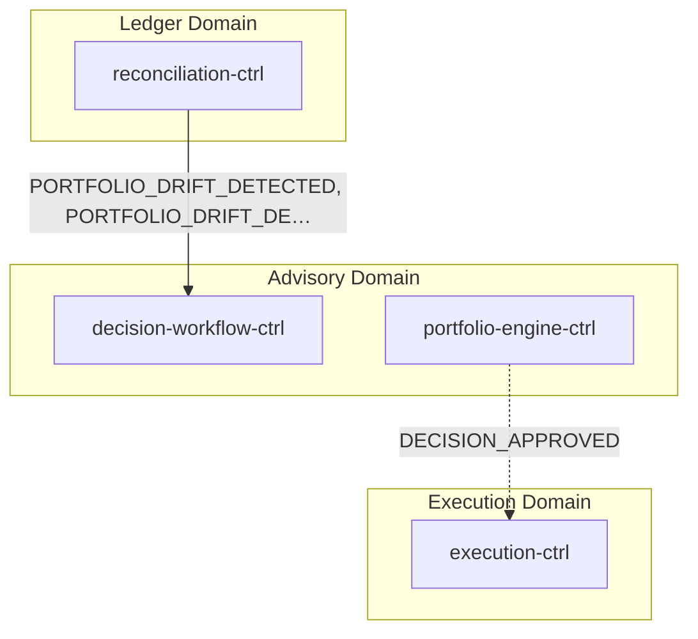
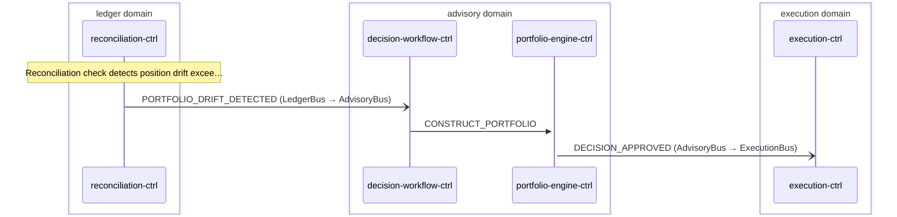

# Portfolio Rebalance

> Portfolio drift detected by reconciliation-ctrl triggers advisory decision cycle which produces rebalance orders

**Domains:** ledger, advisory, execution

**Trigger:** reconciliation-ctrl emits PORTFOLIO_DRIFT_DETECTED (CDC from DriftRecord:INSERT)

## Flowchart

## Sequence Diagram

## Steps

### Step 1: reconciliation-ctrl

- **Action:** Reconciliation check detects position drift exceeding threshold
- **State change:** Writes DriftRecord to DDB with instrument, intentQty, settlementQty, drift values
- **Emits:** `PORTFOLIO_DRIFT_DETECTED (CDC from DriftRecord:INSERT)`
- **Idempotent:** yes

### Step 2: Cross-domain hop

- **Event:** `PORTFOLIO_DRIFT_DETECTED`
- **From:** LedgerBus
- **To:** AdvisoryBus
- **Via:** advisory-adpt EB rule

### Step 3: decision-workflow-ctrl

- **Receives:** `PORTFOLIO_DRIFT_DETECTED`
- **Via:** AdvisoryBus -> SQS -> decision-workflow-ctrl-TriggerIngress
- **State change:** Starts new SF execution for rebalance decision cycle (same as advisory-cycle flow)
- **Emits:** `DECISION_PACKET_CREATED (CDC)`
- **Idempotent:** yes

### Step 4: portfolio-engine-ctrl

- **Receives:** `CONSTRUCT_PORTFOLIO`
- **Via:** AdvisoryBus -> SQS -> portfolio-engine-ctrl-ingress
- **State change:** Constructs rebalance plan (buy/sell orders to correct drift); produces REBALANCE_PLAN_PRODUCED
- **Emits:** `PORTFOLIO_COMPLETED (explicit via event-publisher)`
- **Idempotent:** no

### Step 5: Cross-domain hop

- **Event:** `DECISION_APPROVED`
- **From:** AdvisoryBus
- **To:** ExecutionBus
- **Via:** execution-adpt EB rule

### Step 6: execution-ctrl

- **Receives:** `DECISION_APPROVED`
- **Via:** ExecutionBus -> SQS -> execution-ctrl-ingress
- **State change:** Creates rebalance orders (buy/sell) from decision packet
- **Emits:** `ORDER_SUBMITTED or ORDER_STAGED (CDC)`
- **Idempotent:** yes

## Success Criteria

- Portfolio drift detected and quantified in DriftRecords
- Advisory decision cycle produces rebalance plan
- Rebalance orders created and executed
- Post-execution, reconciliation confirms drift is resolved

## Failure Modes

- **step 1 fails:** reconciliation-ctrl ingress DLQ; drift not detected
- **step 2 fails:** ledger-adpt ToAdvisoryDLQ; advisory not notified of drift
- **step 3 fails:** decision-workflow-ctrl TriggerIngress DLQ; rebalance cycle not started
- **step 4 fails:** portfolio-engine-ctrl agent failure; SF task token times out
- **step 6 fails:** execution-ctrl ingress DLQ; rebalance orders not created
