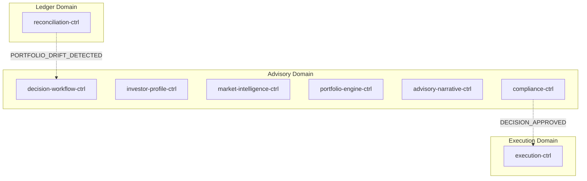
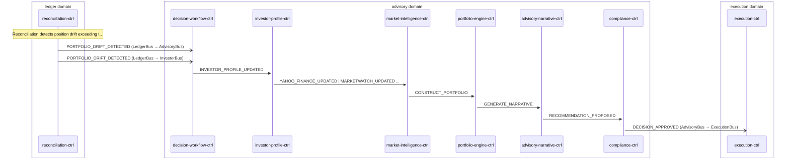

# Portfolio Rebalance

> Portfolio drift detected by reconciliation-ctrl triggers advisory decision cycle which produces rebalance orders

**Domains:** ledger, advisory, execution

**Trigger:** reconciliation-ctrl emits PORTFOLIO_DRIFT_DETECTED (CDC from DriftRecord insert)

## Flowchart

## Sequence Diagram

## Steps

### Step 1: reconciliation-ctrl

- **Action:** Reconciliation detects position drift exceeding threshold
- **State change:** Writes DriftRecord to DDB (tenantId, instrument, intentQty, settlementQty, drift)
- **Emits:** `PORTFOLIO_DRIFT_DETECTED (CDC from DriftRecord insert)`
- **Idempotent:** yes

### Step 2: Cross-domain hop

- **Event:** `PORTFOLIO_DRIFT_DETECTED`
- **From:** LedgerBus
- **To:** AdvisoryBus
- **Via:** advisory-adpt EB rule (AdvisoryIngress-FromLedger, DLQ FromLedgerDLQ 14d)

### Step 3: Cross-domain hop

- **Event:** `PORTFOLIO_DRIFT_DETECTED`
- **From:** LedgerBus
- **To:** InvestorBus
- **Via:** investor-adpt EB rule (InvestorIngress-FromLedger, DLQ FromLedgerDLQ 14d)

### Step 4: decision-workflow-ctrl

- **Receives:** `PORTFOLIO_DRIFT_DETECTED`
- **Via:** AdvisoryBus → EventBridge target → Step Functions (direct EB → SF)
- **State change:** SF execution starts; decisionId minted in UnpackTriggerEnvelope; no DDB write at trigger time
- **Emits:** `nothing at this step (DecisionPacket row written by AssemblePacket later in the SF)`
- **Idempotent:** yes

### Step 5: investor-profile-ctrl

- **Receives:** `INVESTOR_PROFILE_UPDATED`
- **Via:** AdvisoryBus → SQS → investor-profile-ctrl-ingress (continuous projection, NOT per-cycle)
- **State change:** Runs user-goals (Haiku) + risk-assessment (Sonnet) agents; upserts InvestorProfileSnapshot row to DDB
- **Emits:** `INVESTOR_PROFILE_SNAPSHOT_CREATED (insert) / INVESTOR_PROFILE_SNAPSHOT_UPDATED (modify) (CDC from InvestorProfileSnapshot row)`
- **Idempotent:** no

### Step 6: market-intelligence-ctrl

- **Receives:** `YAHOO_FINANCE_UPDATED, MARKETWATCH_UPDATED, SEC_8K_FILED, FRED_INDICATORS_UPDATED, ALPHA_VANTAGE_NEWS_UPDATED, MARKET_SNAPSHOT_REFRESH_TICK`
- **Via:** AdvisoryBus → SQS → market-intelligence-ctrl-ingress (continuous projection, NOT per-cycle)
- **State change:** Runs market-research (Sonnet) agent; upserts MarketSnapshot row (one per region) to DDB
- **Emits:** `MARKET_SNAPSHOT_UPDATED (CDC from MarketSnapshot insert/modify)`
- **Idempotent:** no

### Step 7: portfolio-engine-ctrl

- **Receives:** `CONSTRUCT_PORTFOLIO`
- **Via:** AdvisoryBus → SQS → portfolio-engine-ctrl-ingress
- **State change:** Runs portfolio-construction (Sonnet) + rebalance-planner (Nova Pro) agents; writes AgentCompletion (success) or AgentFailure (caught error) row to DDB
- **Emits:** `PORTFOLIO_COMPLETED (CDC from AgentCompletion insert) or PORTFOLIO_FAILED (CDC from AgentFailure insert) — resumes SF via DWC CallbackIngress → SendTaskSuccess/Failure`
- **Idempotent:** no

### Step 8: advisory-narrative-ctrl

- **Receives:** `GENERATE_NARRATIVE`
- **Via:** AdvisoryBus → SQS → advisory-narrative-ctrl-ingress
- **State change:** Runs explainability (Haiku) agent; writes ReasoningOutput + AgentCompletion (success) / AgentFailure (caught error) rows to DDB
- **Emits:** `EXPLANATION_GENERATED (CDC from ReasoningOutput insert), NARRATIVE_COMPLETED (CDC from AgentCompletion insert) / NARRATIVE_FAILED (CDC from AgentFailure insert) — resumes SF via DWC CallbackIngress → SendTaskSuccess/Failure`
- **Idempotent:** no

### Step 9: compliance-ctrl

- **Receives:** `RECOMMENDATION_PROPOSED`
- **Via:** AdvisoryBus → SQS → compliance-ctrl-ingress
- **State change:** Evaluates mandate, guardrails, suitability; writes ComplianceCheck + AuditArtifact to DDB
- **Emits:** `DECISION_APPROVED or DECISION_BLOCKED (CDC from ComplianceCheck insert, field-mapped on result); AuditArtifact written to DDB but NOT CDC-emitted`
- **Idempotent:** yes

### Step 10: Cross-domain hop

- **Event:** `DECISION_APPROVED`
- **From:** AdvisoryBus
- **To:** ExecutionBus
- **Via:** execution-adpt EB rule (ExecutionIngress-FromAdvisory, DLQ FromAdvisoryDLQ 14d)

### Step 11: execution-ctrl

- **Receives:** `DECISION_APPROVED`
- **Via:** ExecutionBus → SQS → execution-ctrl-ingress
- **State change:** Safety checks → writes Order (SUBMITTED|STAGED|REJECTED) + optional StagedOrder to DDB
- **Emits:** `ORDER_SUBMITTED or ORDER_STAGED or ORDER_REJECTED (CDC from Order insert, status-based mapping)`
- **Idempotent:** yes

## Success Criteria

- Drift quantified in DriftRecord by reconciliation-ctrl
- Advisory decision cycle (PE + AN per-cycle agents; IP + MI precomputed snapshots) produces rebalance plan with proposed trades
- Compliance-ctrl evaluates and approves decision packet
- Rebalance orders created in execution-ctrl (SUBMITTED or STAGED)
- Staged orders processed at next market open

## Failure Modes

- **step 1 fails:** reconciliation-ctrl ingress DLQ; drift remains undetected
- **step 2 fails:** advisory-adpt FromLedgerDLQ (14d retention); advisory domain not notified
- **step 3 fails:** EventBridge → SF native target invocation fails or is throttled; decision cycle not started; trigger event sits on the source bus DLQ if a downstream rule failure cascades back
- **step 4a (snapshot lookup) misses:** InvestorProfileSnapshot/MarketSnapshot row absent; SF Choice routes to HandleMissing* (empty agentOutput default); PE+AN degrade the decision via `?? {}` rather than aborting the cycle (tolerated, not a failure)
- **step 4b fails:** portfolio-engine-ctrl agent failure; SF task token expires
- **step 4c fails:** advisory-narrative-ctrl agent failure; SF task token expires
- **step 7 fails:** compliance-ctrl ingress DLQ; compliance evaluation not performed
- **step 8 fails:** compliance callback fails; SF WaitForCompliance times out (72h SF timeout)
- **step 9 fails:** execution-adpt FromAdvisoryDLQ (14d retention); execution not notified
- **step 10 fails:** execution-ctrl ingress DLQ; rebalance orders not created
- **safety checks fail:** Order written with status REJECTED; no broker submission
