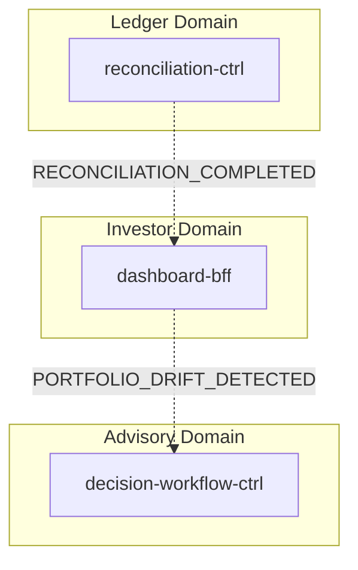
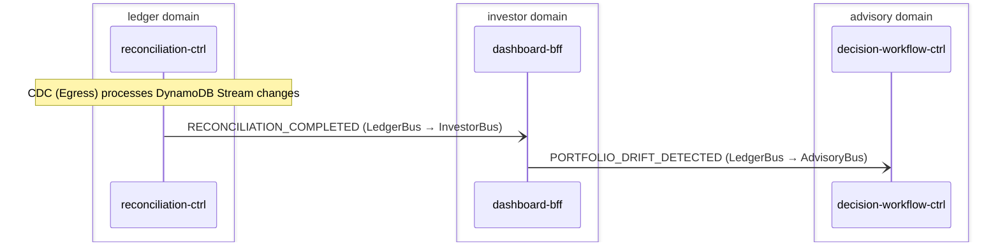

# Reconciliation

> reconciliation-ctrl compares intent positions against settlement positions per instrument, producing DriftRecord items for mismatches and a ReconciliationResult summary. CDC emits RECONCILIATION_COMPLETED and PORTFOLIO_DRIFT_DETECTED, which cross domains to update the investor dashboard and trigger the advisory rebalance cycle.

**Domains:** ledger, investor, advisory, execution

**Trigger:** Any of four events arriving on LedgerBus: PORTFOLIO_UPDATED (CDC from ledger-ctrl PortfolioEvent:INSERT), PORTFOLIO_SNAPSHOT_IMPORTED (execution cross-domain, pulled by ledger-adpt from ExecutionBus), CORPORATE_ACTION_APPLIED (execution cross-domain, pulled by ledger-adpt from ExecutionBus), ALPACA_ACCOUNT_SNAPSHOT (CDC from broker-alpaca-adpt AlpacaAccountSnapshot:INSERT, pulled by ledger-adpt from ExecutionBus)

## Flowchart

## Sequence Diagram

## Steps

### Step 1: Cross-domain hop

- **Event:** `PORTFOLIO_SNAPSHOT_IMPORTED`
- **From:** ExecutionBus
- **To:** LedgerBus
- **Via:** ledger-adpt EB rule (LedgerIngress-FromExecution)

### Step 2: Cross-domain hop

- **Event:** `CORPORATE_ACTION_APPLIED`
- **From:** ExecutionBus
- **To:** LedgerBus
- **Via:** ledger-adpt EB rule (LedgerIngress-FromExecution)

### Step 3: Cross-domain hop

- **Event:** `ALPACA_ACCOUNT_SNAPSHOT`
- **From:** ExecutionBus
- **To:** LedgerBus
- **Via:** ledger-adpt EB rule (LedgerIngress-FromExecution)

### Step 4: reconciliation-ctrl

- **Receives:** `PORTFOLIO_UPDATED | PORTFOLIO_SNAPSHOT_IMPORTED | CORPORATE_ACTION_APPLIED`
- **Action:** Calls ReconciliationService.reconcile() which builds intent and settlement position maps from the event payload, iterates all instruments, and computes drift (intentQty - settlementQty) for each. Instruments with abs(drift) > 0.001 produce DriftEntry items. Status is DRIFT_DETECTED if any drifts exist, otherwise COMPLETED.
- **Via:** LedgerBus -> SQS -> reconciliation-ctrl-ingress
- **State change:** Writes ReconciliationResult record (pk=Reconciliation#tenantId#reconciliationId, sk=Reconciliation) with status and driftCount. Writes one DriftRecord per mismatched instrument (sk=DriftRecord#instrument) with intentQty, settlementQty, and drift.
- **Idempotent:** yes

### Step 5: reconciliation-ctrl

- **Receives:** `ALPACA_ACCOUNT_SNAPSHOT`
- **Action:** Same reconciliation logic as reconcileHandler but reads positions from Alpaca-format payload (qty field instead of quantity). Calls ReconciliationService.reconcile().
- **Via:** LedgerBus -> SQS -> reconciliation-ctrl-ingress
- **State change:** Writes ReconciliationResult and DriftRecord items (same schema as reconcileHandler).
- **Idempotent:** yes

### Step 6: reconciliation-ctrl

- **Action:** CDC (Egress) processes DynamoDB Stream changes

### Step 7: Cross-domain hop

- **Event:** `RECONCILIATION_COMPLETED`
- **From:** LedgerBus
- **To:** InvestorBus
- **Via:** investor-adpt EB rule (InvestorIngress-FromLedger)

### Step 8: dashboard-bff

- **Receives:** `RECONCILIATION_COMPLETED`
- **Via:** InvestorBus -> SQS -> dashboard-bff-ingress
- **State change:** Updates PortfolioSummary projection via portfolioSummary transform
- **Idempotent:** yes

### Step 9: Cross-domain hop

- **Event:** `PORTFOLIO_DRIFT_DETECTED`
- **From:** LedgerBus
- **To:** AdvisoryBus
- **Via:** advisory-adpt EB rule (AdvisoryIngress-FromLedger)

### Step 10: decision-workflow-ctrl

- **Receives:** `PORTFOLIO_DRIFT_DETECTED`
- **Action:** PORTFOLIO_DRIFT_DETECTED is one of the 7 TRIGGER_EVENT_TYPES that start the decision Step Functions workflow directly from EventBridge. The SF runs the 4-agent pipeline + compliance check (see advisory-cycle.flow.yaml).
- **Via:** AdvisoryBus -> EventBridge target -> Step Functions (direct EB -> SF)
- **State change:** SF execution starts; decisionId minted in UnpackTriggerEnvelope
- **Idempotent:** yes

## Success Criteria

- Intent and settlement positions compared for all instruments in the event payload
- DriftRecord created per instrument where abs(drift) > 0.001
- ReconciliationResult written with status COMPLETED or DRIFT_DETECTED and accurate driftCount
- RECONCILIATION_COMPLETED reaches dashboard-bff and updates PortfolioSummary projection
- PORTFOLIO_DRIFT_DETECTED reaches decision-workflow-ctrl and triggers a Step Functions execution (rebalance)

## Failure Modes

- **step 4-5 fails:** reconciliation-ctrl ingress DLQ; reconciliation not executed
- **step 6 fails:** CDC not emitted; downstream domains not notified
- **step 7 fails:** investor-adpt FromLedgerDLQ; dashboard not updated with reconciliation status
- **step 8 fails:** dashboard-bff ingress DLQ; portfolio summary stale
- **step 9 fails:** advisory-adpt FromLedgerDLQ; rebalance not triggered
- **step 10 fails:** EventBridge → SF native target invocation fails or is throttled; decision cycle not started
