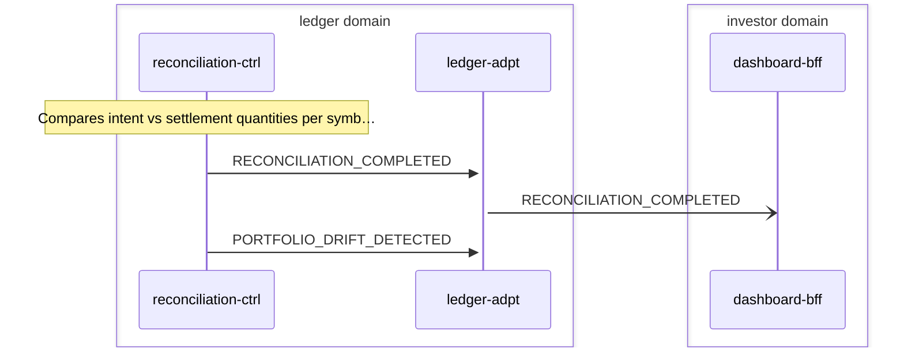

# Reconciliation

> Reconciliation-ctrl compares intent positions (from portfolio events) against settlement positions (from broker snapshots), producing drift records and completion events

**Domains:** ledger, execution, investor

**Trigger:** ledger-ctrl emits PORTFOLIO_UPDATED (CDC from PortfolioEvent:INSERT) or execution domain emits PORTFOLIO_SNAPSHOT_IMPORTED / ALPACA_ACCOUNT_SNAPSHOT

## Flow Diagram

## Steps

### Step 1: reconciliation-ctrl

- **Receives:** `PORTFOLIO_UPDATED`
- **Via:** LedgerBus -> SQS -> reconciliation-ctrl-ingress
- **State change:** Updates intent-side position snapshot from portfolio event
- **Idempotent:** yes

### Step 2: reconciliation-ctrl

- **Receives:** `PORTFOLIO_SNAPSHOT_IMPORTED`
- **Via:** LedgerBus -> SQS -> reconciliation-ctrl-ingress
- **State change:** Updates settlement-side position snapshot from broker portfolio import
- **Idempotent:** yes

### Step 3: reconciliation-ctrl

- **Receives:** `CORPORATE_ACTION_APPLIED`
- **Via:** LedgerBus -> SQS -> reconciliation-ctrl-ingress
- **State change:** Adjusts positions for corporate actions (splits, dividends)
- **Idempotent:** yes

### Step 4: reconciliation-ctrl

- **Receives:** `ALPACA_ACCOUNT_SNAPSHOT`
- **Via:** LedgerBus -> SQS -> reconciliation-ctrl-ingress
- **State change:** Updates settlement-side positions from Alpaca account snapshot
- **Idempotent:** yes

### Step 5: reconciliation-ctrl

- **Action:** Compares intent vs settlement quantities per symbol
- **State change:** Writes DriftRecord for each mismatch; writes ReconciliationResult (status, driftCount)
- **Emits:** `RECONCILIATION_COMPLETED (CDC from ReconciliationResult:INSERT), PORTFOLIO_DRIFT_DETECTED (CDC from DriftRecord:INSERT)`
- **Idempotent:** yes

### Step 6: ledger-adpt

- **Receives:** `RECONCILIATION_COMPLETED`
- **Via:** LedgerBus -> ledger-adpt ToInvestor rule
- **Forwards to:** InvestorBus
- **Emits:** `RECONCILIATION_COMPLETED`

### Step 7: dashboard-bff

- **Receives:** `RECONCILIATION_COMPLETED`
- **Via:** InvestorBus -> SQS -> dashboard-bff-ingress
- **State change:** Updates portfolio summary with reconciliation status (flags if drifts found)
- **Idempotent:** yes

### Step 8: ledger-adpt

- **Receives:** `PORTFOLIO_DRIFT_DETECTED`
- **Via:** LedgerBus -> ledger-adpt ToAdvisory rule
- **Forwards to:** AdvisoryBus
- **Emits:** `PORTFOLIO_DRIFT_DETECTED`

## Success Criteria

- Intent and settlement positions compared for all instruments
- DriftRecords created for each mismatch
- RECONCILIATION_COMPLETED event reaches dashboard for display
- PORTFOLIO_DRIFT_DETECTED triggers rebalance cycle if drift exceeds threshold

## Failure Modes

- **step 1-4 fails:** reconciliation-ctrl ingress DLQ; reconciliation not triggered
- **step 5 fails:** CDC event not emitted; downstream not notified
- **step 6 fails:** ledger-adpt ToInvestorDLQ; dashboard not updated
- **step 8 fails:** ledger-adpt ToAdvisoryDLQ; rebalance not triggered
