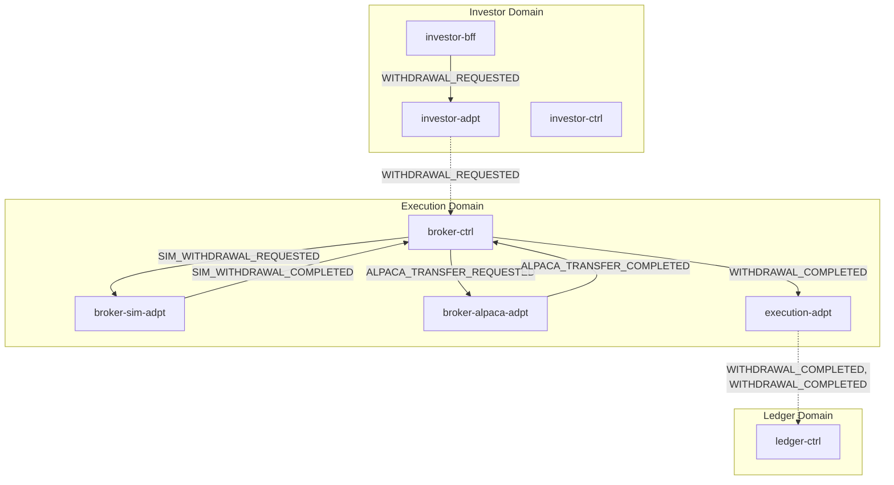
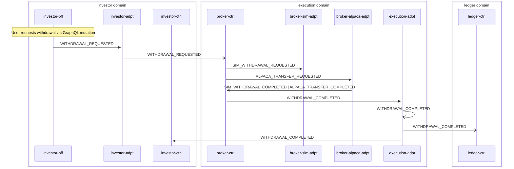

# Withdrawal

> Investor requests a withdrawal, routed through broker-ctrl to sim or Alpaca adapter, normalized back to canonical events

**Domains:** investor, execution, ledger

**Trigger:** investor-bff emits WITHDRAWAL_REQUESTED (CDC from Withdrawal:INSERT)

## Flowchart

## Sequence Diagram

## Steps

### Step 1: investor-bff

- **Action:** User requests withdrawal via GraphQL mutation
- **State change:** Writes Withdrawal record to DDB
- **Emits:** `WITHDRAWAL_REQUESTED (CDC)`
- **Idempotent:** yes

### Step 2: investor-adpt

- **Receives:** `WITHDRAWAL_REQUESTED`
- **Via:** InvestorBus -> investor-adpt ToExecution rule
- **Forwards to:** ExecutionBus
- **Emits:** `WITHDRAWAL_REQUESTED`

### Step 3: broker-ctrl

- **Receives:** `WITHDRAWAL_REQUESTED`
- **Via:** ExecutionBus -> SQS -> broker-ctrl-DepositWithdrawalIngress
- **State change:** deposit-withdrawal-router reads ExecutionMode and routes to SIM_WITHDRAWAL_REQUESTED or ALPACA_TRANSFER_REQUESTED
- **Emits:** `SIM_WITHDRAWAL_REQUESTED or ALPACA_TRANSFER_REQUESTED (explicit publish)`
- **Idempotent:** yes

### Step 4: broker-sim-adpt

- **Receives:** `SIM_WITHDRAWAL_REQUESTED`
- **Via:** ExecutionBus -> SQS -> broker-sim-adpt-ingress
- **State change:** Simulates withdrawal, writes WithdrawalCompleted record
- **Emits:** `SIM_WITHDRAWAL_COMPLETED (CDC)`
- **Idempotent:** yes

### Step 5: broker-alpaca-adpt

- **Receives:** `ALPACA_TRANSFER_REQUESTED`
- **Via:** ExecutionBus -> SQS -> broker-alpaca-adpt-ingress
- **State change:** Submits ACH withdrawal to Alpaca API, writes AlpacaTransferResult
- **Emits:** `ALPACA_TRANSFER_COMPLETED or ALPACA_TRANSFER_FAILED (CDC)`
- **Idempotent:** yes

### Step 6: broker-ctrl

- **Receives:** `SIM_WITHDRAWAL_COMPLETED | ALPACA_TRANSFER_COMPLETED`
- **Via:** ExecutionBus -> SQS -> broker-ctrl-DepositWithdrawalNormalizerIngress
- **State change:** Writes NormalizedEvent record (sk = WITHDRAWAL_COMPLETED)
- **Emits:** `WITHDRAWAL_COMPLETED (CDC from NormalizedEvent:INSERT, sk is event type)`
- **Idempotent:** yes

### Step 7: execution-adpt

- **Receives:** `WITHDRAWAL_COMPLETED`
- **Via:** ExecutionBus -> execution-adpt ToInvestor rule
- **Forwards to:** InvestorBus
- **Emits:** `WITHDRAWAL_COMPLETED`

### Step 8: execution-adpt

- **Receives:** `WITHDRAWAL_COMPLETED`
- **Via:** ExecutionBus -> execution-adpt ToLedger rule
- **Forwards to:** LedgerBus
- **Emits:** `WITHDRAWAL_COMPLETED`

### Step 9: ledger-ctrl

- **Receives:** `WITHDRAWAL_COMPLETED`
- **Via:** LedgerBus -> SQS -> ledger-ctrl-ingress
- **State change:** Records BalanceEvent (debit) and LedgerEntryEvent; reducer materializes account snapshot
- **Emits:** `BALANCE_UPDATED, LEDGER_ENTRY_RECORDED (CDC)`
- **Idempotent:** yes

### Step 10: investor-ctrl

- **Receives:** `WITHDRAWAL_COMPLETED`
- **Via:** InvestorBus -> SQS -> investor-ctrl-ingress
- **State change:** Updates investor lifecycle state
- **Emits:** `NOTIFICATION_CREATED (CDC)`
- **Idempotent:** yes

## Success Criteria

- Withdrawal amount debited in ledger-ctrl balance
- BALANCE_UPDATED event reaches investor domain
- WITHDRAWAL_COMPLETED event reaches investor-ctrl for notification

## Failure Modes

- **step 2 fails:** investor-adpt ToExecutionDLQ; withdrawal not routed to execution domain
- **step 3 fails:** broker-ctrl DepositWithdrawalIngress DLQ; withdrawal not routed to adapter
- **step 4 fails:** broker-sim-adpt ingress DLQ; simulated withdrawal stuck
- **step 5 fails:** broker-alpaca-adpt ingress DLQ; Alpaca withdrawal not submitted
- **step 6 fails:** broker-ctrl DepositWithdrawalNormalizerIngress DLQ; normalized event not created
- **step 9 fails:** ledger-ctrl ingress DLQ; balance not updated
