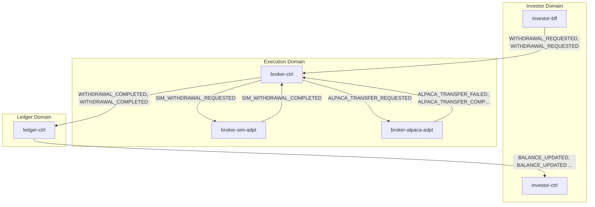
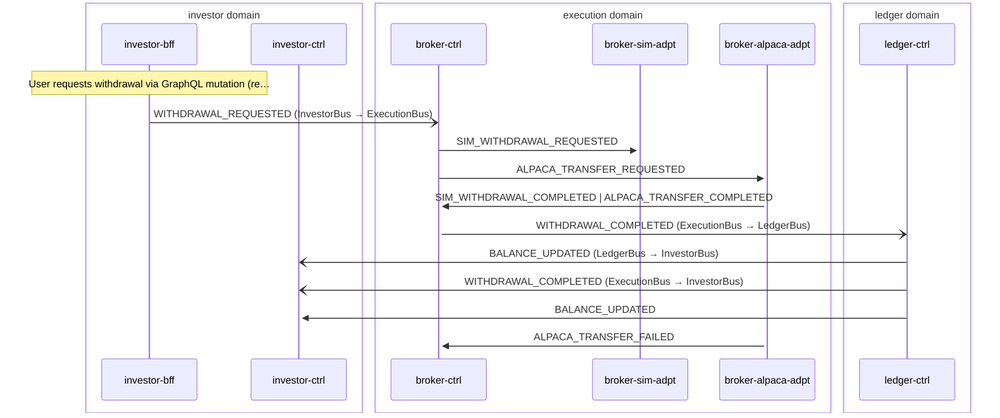

# Withdrawal

> Investor requests a withdrawal, routed through broker-ctrl to sim or Alpaca adapter, normalized back to canonical events, ledger debited, investor notified

**Domains:** investor, execution, ledger

**Trigger:** investor-bff emits WITHDRAWAL_REQUESTED (CDC from Withdrawal:INSERT)

## Flowchart

## Sequence Diagram

## Steps

### Step 1: investor-bff

- **Action:** User requests withdrawal via GraphQL mutation (request-withdrawal.fn.js)
- **State change:** Transact — deducts CashBalance optimistically and writes Withdrawal record (status REQUESTED) to DDB
- **Emits:** `WITHDRAWAL_REQUESTED (CDC from Withdrawal INSERT)`
- **Idempotent:** yes

### Step 2: Cross-domain hop

- **Event:** `WITHDRAWAL_REQUESTED`
- **From:** InvestorBus
- **To:** ExecutionBus
- **Via:** execution-adpt EB rule (ExecutionIngress-FromInvestor)

### Step 3: broker-ctrl

- **Receives:** `WITHDRAWAL_REQUESTED`
- **Via:** ExecutionBus -> SQS -> broker-ctrl-DepositWithdrawalIngress
- **State change:** deposit-withdrawal-router reads ExecutionMode and routes to SIM_WITHDRAWAL_REQUESTED or ALPACA_TRANSFER_REQUESTED (with direction OUTGOING)
- **Emits:** `SIM_WITHDRAWAL_REQUESTED or ALPACA_TRANSFER_REQUESTED (explicit publish to ExecutionBus)`
- **Idempotent:** yes

### Step 4: broker-sim-adpt

- **Receives:** `SIM_WITHDRAWAL_REQUESTED`
- **Via:** ExecutionBus -> SQS -> broker-sim-adpt-ingress
- **State change:** Validates sufficient virtual cash, performs guarded atomic debit on VirtualLedger, writes WithdrawalCompleted record
- **Emits:** `SIM_WITHDRAWAL_COMPLETED (CDC from WithdrawalCompleted INSERT)`
- **Idempotent:** yes

### Step 5: broker-alpaca-adpt

- **Receives:** `ALPACA_TRANSFER_REQUESTED`
- **Via:** ExecutionBus -> SQS -> broker-alpaca-adpt-ingress
- **State change:** Submits ACH transfer to Alpaca API (direction OUTGOING), writes AlpacaTransferResult record (status INITIATED or FAILED)
- **Emits:** `ALPACA_TRANSFER_INITIATED or ALPACA_TRANSFER_FAILED (CDC from AlpacaTransferResult INSERT)`
- **Idempotent:** yes

### Step 6: broker-alpaca-adpt

- **Receives:** `ALPACA_TRANSFER_INITIATED (triggers TransferPollingStateMachine)`
- **Via:** ExecutionBus -> Orchestration trigger
- **State change:** TransferPollingStateMachine polls Alpaca API for transfer status; TransferPollFn updates AlpacaTransferResult to COMPLETED or FAILED
- **Emits:** `ALPACA_TRANSFER_COMPLETED or ALPACA_TRANSFER_FAILED (CDC from AlpacaTransferResult modify)`
- **Idempotent:** yes

### Step 7: broker-ctrl

- **Receives:** `SIM_WITHDRAWAL_COMPLETED | ALPACA_TRANSFER_COMPLETED`
- **Via:** ExecutionBus -> SQS -> broker-ctrl-DepositWithdrawalNormalizerIngress
- **State change:** Writes NormalizedEvent record (sk = WITHDRAWAL_COMPLETED)
- **Emits:** `WITHDRAWAL_COMPLETED (CDC from NormalizedEvent INSERT, sk passthrough determines event type)`
- **Idempotent:** yes

### Step 8: Cross-domain hop

- **Event:** `WITHDRAWAL_COMPLETED`
- **From:** ExecutionBus
- **To:** LedgerBus
- **Via:** ledger-adpt EB rule (LedgerIngress-FromExecution)

### Step 9: ledger-ctrl

- **Receives:** `WITHDRAWAL_COMPLETED`
- **Via:** LedgerBus -> SQS -> ledger-ctrl-ingress
- **State change:** Records LedgerEntry (actual stream); reducer applies RecordWithdrawal command — debits cashBalanceCents; writes BalanceEvent and LedgerEntryEvent
- **Emits:** `BALANCE_UPDATED, LEDGER_ENTRY_RECORDED (CDC from BalanceEvent INSERT, LedgerEntryEvent INSERT)`
- **Idempotent:** yes

### Step 10: Cross-domain hop

- **Event:** `BALANCE_UPDATED`
- **From:** LedgerBus
- **To:** InvestorBus
- **Via:** investor-adpt EB rule (InvestorIngress-FromLedger)

### Step 11: Cross-domain hop

- **Event:** `WITHDRAWAL_COMPLETED`
- **From:** ExecutionBus
- **To:** InvestorBus
- **Via:** investor-adpt EB rule (InvestorIngress-FromExecution)

### Step 12: investor-ctrl

- **Receives:** `WITHDRAWAL_COMPLETED`
- **Via:** InvestorBus -> SQS -> investor-ctrl-trigger-ingress
- **State change:** Creates Notification record (title "Withdrawal Completed", channel email)
- **Emits:** `NOTIFICATION (CDC from Notification INSERT)`
- **Idempotent:** yes

### Step 13: investor-ctrl

- **Receives:** `BALANCE_UPDATED`
- **Via:** InvestorBus -> SQS -> investor-ctrl-trigger-ingress
- **State change:** Creates Notification record for balance update
- **Emits:** `NOTIFICATION (CDC from Notification INSERT)`
- **Idempotent:** yes

### Step 14: broker-ctrl

- **Receives:** `ALPACA_TRANSFER_FAILED`
- **Via:** ExecutionBus -> SQS -> broker-ctrl-DepositWithdrawalNormalizerIngress
- **State change:** Writes NormalizedEvent record (sk = TRANSFER_FAILED)
- **Emits:** `TRANSFER_FAILED (CDC from NormalizedEvent INSERT, sk passthrough determines event type)`
- **Idempotent:** yes

### Step 15: Cross-domain hop

- **Event:** `TRANSFER_FAILED`
- **From:** ExecutionBus
- **To:** InvestorBus
- **Via:** investor-adpt EB rule (InvestorIngress-FromExecution)

### Step 16: Cross-domain hop

- **Event:** `TRANSFER_FAILED`
- **From:** ExecutionBus
- **To:** LedgerBus
- **Via:** ledger-adpt EB rule (LedgerIngress-FromExecution)

## Success Criteria

- Withdrawal amount debited in ledger-ctrl cash balance
- WITHDRAWAL_COMPLETED event reaches both ledger and investor domains
- BALANCE_UPDATED event reaches investor domain
- LEDGER_ENTRY_RECORDED event persists audit trail
- Investor receives withdrawal completion notification via investor-ctrl

## Failure Modes

- **step 2 fails:** execution-adpt FromInvestorDLQ; withdrawal not routed to execution domain
- **step 3 fails:** broker-ctrl DepositWithdrawalIngress DLQ; withdrawal not routed to adapter
- **step 4 fails (sim):** broker-sim-adpt ingress DLQ; simulated withdrawal not completed
- **step 5 fails (live):** broker-alpaca-adpt ingress DLQ; Alpaca transfer not submitted
- **step 6 fails (live):** TransferPollingStateMachine timeout (7 days); transfer status unknown, marked FAILED
- **step 7 fails:** broker-ctrl DepositWithdrawalNormalizerIngress DLQ; normalized event not created
- **step 9 fails:** ledger-ctrl ingress DLQ; balance not updated
- **step 5 Alpaca transfer fails:** ALPACA_TRANSFER_FAILED flows to normalizer, writes TRANSFER_FAILED NormalizedEvent, emitted via CDC passthrough
