# Advisory-Ctrl: Current Single-Service Architecture

```mermaid
flowchart TB
    subgraph INGRESS["Ingress Events (EventBridge → SQS → Lambda)"]
        direction TB
        IE1["MANDATE_GRANTED<br/><i>investor-adpt</i>"]
        IE2["GOAL_UPDATED<br/><i>investor-adpt</i>"]
        IE3["RISK_PROFILE_UPDATED<br/><i>investor-adpt</i>"]
        IE4["OPERATING_MODE_CHANGED<br/><i>investor-adpt</i>"]
        IE5["PORTFOLIO_DRIFT_DETECTED<br/><i>ledger-adpt</i>"]
        IE6["ORDER_FILLED<br/><i>execution-adpt</i>"]
        IE7["ORDER_REJECTED<br/><i>execution-adpt</i>"]
        IE8["ORDER_CANCELLED<br/><i>execution-adpt</i>"]
        IE9["DEPOSIT_DETECTED<br/><i>execution-adpt</i>"]
        IE10["DECISION_APPROVED<br/><i>compliance-ctrl</i>"]
        IE11["DECISION_BLOCKED<br/><i>compliance-ctrl</i>"]
        IE12["USER_CONFIRMED<br/><i>advisory-bff</i>"]
        IE13["USER_REJECTED<br/><i>advisory-bff</i>"]
    end

    subgraph LISTENER["event-listener Lambda"]
        direction TB
        ROUTE{"Route by<br/>event type"}
        TRIGGER["handleTriggerEvent()"]
        COMPLIANCE["processComplianceCallback()"]
        USERRESP["processUserResponse()"]
        ROUTE -->|"9 trigger types"| TRIGGER
        ROUTE -->|"APPROVED / BLOCKED"| COMPLIANCE
        ROUTE -->|"CONFIRMED / REJECTED"| USERRESP
    end

    subgraph SERVICE["DecisionLifecycleService"]
        direction TB
        IDEMP["Idempotency Check<br/><i>putIfNotExists(decisionPacket)</i>"]
        PIPELINE["runAgentPipeline()"]
        RECORD["recordAgentInvocations()<br/><i>per-agent DDB writes</i>"]
        EXTRACT["extractTrades() +<br/>composeExplanation()"]
        UPDATE["updateDecisionStatus()<br/><i>AGENTS_COMPLETED</i>"]
        IDEMP -->|"new"| PIPELINE
        IDEMP -->|"duplicate"| SKIP["Return DUPLICATE"]
        PIPELINE --> RECORD
        RECORD --> EXTRACT
        EXTRACT --> UPDATE
    end

    subgraph GRAPH["LangGraph StateGraph (agent-core)"]
        direction TB

        subgraph WAVE1["Wave 1 — Promise.all (parallel)"]
            direction LR
            subgraph UG["user-goals"]
                UG_PROMPT["Prompt: goal interpretation<br/><i>.txt template</i>"]
                UG_MODEL["ChatBedrockConverse<br/><b>Haiku</b> · 2048 tok · t=0.0"]
                UG_SCHEMA["Zod: GoalInterpretation<br/><i>goals[], timeHorizon, riskWillingness</i>"]
                UG_VALID["Validate: horizon 1-600mo,<br/>efficiency frontier check"]
                UG_PROMPT --> UG_MODEL --> UG_SCHEMA --> UG_VALID
            end
            subgraph RA["risk-assessment"]
                RA_PROMPT["Prompt: risk profiling<br/><i>.txt template</i>"]
                RA_MODEL["ChatBedrockConverse<br/><b>Opus</b> · 4096 tok · t=0.1"]
                RA_SCHEMA["Zod: RiskAssessment<br/><i>score, category, maxDrawdown</i>"]
                RA_VALID["Validate: score-category<br/>consistency, drawdown sanity"]
                RA_PROMPT --> RA_MODEL --> RA_SCHEMA --> RA_VALID
            end
            subgraph MR["market-research"]
                MR_PROMPT["Prompt: market signals<br/><i>.txt template</i>"]
                MR_MODEL["ChatBedrockConverse<br/><b>Sonnet</b> · 4096 tok · t=0.2"]
                MR_SCHEMA["Zod: MarketResearch<br/><i>signals[], tickers[], outlook</i>"]
                MR_VALID["Validate: no duplicate<br/>tickers"]
                MR_PROMPT --> MR_MODEL --> MR_SCHEMA --> MR_VALID
            end
        end

        subgraph WAVE2["Wave 2 — Promise.all (parallel, depends on Wave 1)"]
            direction LR
            subgraph PC["portfolio-construction"]
                PC_PROMPT["Prompt: allocation design<br/><i>.txt template</i>"]
                PC_MODEL["ChatBedrockConverse<br/><b>Opus</b> · 4096 tok · t=0.1"]
                PC_SCHEMA["Zod: PortfolioConstruction<br/><i>allocations[], expectedReturn</i>"]
                PC_VALID["Validate: weights ≈1.0,<br/>position limits, min alloc"]
                PC_PROMPT --> PC_MODEL --> PC_SCHEMA --> PC_VALID
            end
            subgraph RP["rebalance-planner"]
                RP_PROMPT["Prompt: trade planning<br/><i>.txt template</i>"]
                RP_MODEL["ChatBedrockConverse<br/><b>Sonnet</b> · 4096 tok · t=0.1"]
                RP_SCHEMA["Zod: RebalancePlan<br/><i>trades[], urgency, costBps</i>"]
                RP_VALID["Validate: trade urgency,<br/>cost basis points"]
                RP_PROMPT --> RP_MODEL --> RP_SCHEMA --> RP_VALID
            end
        end

        subgraph WAVE3["Wave 3 — Serial (depends on Wave 2)"]
            subgraph EX["explainability"]
                EX_PROMPT["Prompt: user explanation<br/><i>.txt template</i>"]
                EX_MODEL["ChatBedrockConverse<br/><b>Sonnet</b> · 8192 tok · t=0.3"]
                EX_SCHEMA["Zod: Explanation<br/><i>summary, rationale, keyFactors[]</i>"]
                EX_VALID["Validate: summary > 20 chars,<br/>≥1 key factor"]
                EX_PROMPT --> EX_MODEL --> EX_SCHEMA --> EX_VALID
            end
        end

        WAVE1 --> WAVE2 --> WAVE3
    end

    subgraph RETRY["Retry & Escalation (per agent node)"]
        direction LR
        TRY["Invoke agent"]
        VCHECK{"Validation<br/>passed?"}
        ESC["Tier escalation<br/><i>Haiku→Sonnet→Opus</i>"]
        FB["Deterministic<br/>fallback node"]
        TRY --> VCHECK
        VCHECK -->|"yes"| OK["Output to state"]
        VCHECK -->|"no, attempt < 3"| ESC --> TRY
        VCHECK -->|"no, max attempts"| FB
    end

    subgraph TOOLS["Agent Tool Lambdas (MCP Gateway)"]
        direction LR
        T1["portfolio-lookup<br/><i>DDB query: PortfolioSnapshot</i>"]
        T2["market-data<br/><i>Static + cached indices/vol</i>"]
        T3["instrument-universe<br/><i>Approved instrument list</i>"]
        T4["event-publisher<br/><i>PutEvents → advisory bus</i>"]
    end

    subgraph STATE["DynamoDB (Single Table)"]
        direction LR
        S1["DecisionPacket<br/><i>PK: TENANT#tid<br/>SK: DP#dpId</i>"]
        S2["AgentInvocation<br/><i>SK: AI#dpId#agent</i>"]
        S3["ReasoningOutput<br/><i>SK: RO#dpId#agent</i>"]
        S4["EditEvent<br/><i>SK: EDIT#dpId#ts</i>"]
    end

    subgraph CDC["Egress — DynamoDB Streams → CDC Lambda"]
        direction TB
        STREAM["DynamoDB Stream<br/><i>FilterCriteria: DecisionPacket,<br/>AgentInvocation, WorkflowState</i>"]
        CDCLAMBDA["event-publisher-cdc<br/><i>changeDataCapture()</i>"]
        STREAM --> CDCLAMBDA
    end

    subgraph EGRESS["Published Events (EventBridge)"]
        direction TB
        OE1["DECISION_PACKET_CREATED"]
        OE2["DECISION_PACKET_ENRICHED"]
        OE3["AGENT_INVOCATION_STARTED"]
        OE4["AGENT_INVOCATION_COMPLETED"]
        OE5["GOAL_INTERPRETATION_PRODUCED"]
        OE6["RISK_EVALUATION_PRODUCED"]
        OE7["MARKET_SIGNAL_DETECTED"]
        OE8["PORTFOLIO_CONSTRUCTION_PROPOSED"]
        OE9["REBALANCE_PLAN_PRODUCED"]
        OE10["EXPLANATION_GENERATED"]
        OE11["RECOMMENDATION_PROPOSED"]
        OE12["USER_CONFIRMATION_REQUESTED"]
    end

    %% Flow connections
    INGRESS --> LISTENER
    LISTENER --> SERVICE
    SERVICE --> GRAPH
    GRAPH -.->|"tool calls"| TOOLS
    GRAPH -.->|"retry/escalation"| RETRY
    SERVICE --> STATE
    STATE --> CDC
    CDC --> EGRESS
    COMPLIANCE --> STATE
    USERRESP --> STATE

    %% Styling
    classDef trigger fill:#e3f2fd,stroke:#1565c0,color:#0d47a1
    classDef agent fill:#fff3e0,stroke:#e65100,color:#bf360c
    classDef infra fill:#f3e5f5,stroke:#6a1b9a,color:#4a148c
    classDef event fill:#e8f5e9,stroke:#2e7d32,color:#1b5e20
    classDef state fill:#fce4ec,stroke:#c62828,color:#b71c1c

    class IE1,IE2,IE3,IE4,IE5,IE6,IE7,IE8,IE9,IE10,IE11,IE12,IE13 trigger
    class UG,RA,MR,PC,RP,EX agent
    class T1,T2,T3,T4 infra
    class OE1,OE2,OE3,OE4,OE5,OE6,OE7,OE8,OE9,OE10,OE11,OE12 event
    class S1,S2,S3,S4 state
```

## Notes

- **No RAG currently** — agents use prompt templates + tool calls (portfolio-lookup, market-data, instrument-universe), not Bedrock Knowledge Bases
- **All 9 trigger events** run the same full 6-agent pipeline — no event-specific routing
- **Retry/escalation** wraps each agent node: validate → retry (up to 3) → escalate tier → deterministic fallback
- **CDC egress** publishes state changes as events via DynamoDB Streams (not direct EventBridge puts from the service)
- **Tool calls** happen during agent inference — Bedrock invokes the tool Lambdas via MCP gateway registered in the AgentRuntime CDK construct
- **Compliance + user response** paths skip the agent pipeline entirely — they only update decision status in DDB
