# Option A: 3-Service Split

```mermaid
flowchart TB
    subgraph INGRESS["Ingress Events (EventBridge)"]
        direction TB
        IE1["MANDATE_GRANTED<br/><i>investor-adpt</i>"]
        IE2["GOAL_UPDATED<br/><i>investor-adpt</i>"]
        IE3["RISK_PROFILE_UPDATED<br/><i>investor-adpt</i>"]
        IE4["OPERATING_MODE_CHANGED<br/><i>investor-adpt</i>"]
        IE5["PORTFOLIO_DRIFT_DETECTED<br/><i>ledger-adpt</i>"]
        IE6["ORDER_FILLED<br/><i>execution-adpt</i>"]
        IE7["ORDER_REJECTED<br/><i>execution-adpt</i>"]
        IE8["ORDER_CANCELLED<br/><i>execution-adpt</i>"]
        IE9["DEPOSIT_DETECTED<br/><i>execution-adpt</i>"]
    end

    subgraph CALLBACK["Callback Events (EventBridge)"]
        direction TB
        CB1["DECISION_APPROVED<br/><i>compliance-ctrl</i>"]
        CB2["DECISION_BLOCKED<br/><i>compliance-ctrl</i>"]
        CB3["USER_CONFIRMED<br/><i>advisory-bff</i>"]
        CB4["USER_REJECTED<br/><i>advisory-bff</i>"]
    end

    %% ===== SERVICE 1: RISK ANALYSIS =====
    subgraph SVC1["risk-analysis-ctrl"]
        direction TB

        subgraph SVC1_LISTENER["event-listener"]
            SVC1_ROUTE{"Route"}
            SVC1_TRIGGER["handleTriggerEvent()"]
            SVC1_COMPLY["processComplianceCallback()"]
            SVC1_USER["processUserResponse()"]
            SVC1_ROUTE -->|"9 triggers"| SVC1_TRIGGER
            SVC1_ROUTE -->|"APPROVED/BLOCKED"| SVC1_COMPLY
            SVC1_ROUTE -->|"CONFIRMED/REJECTED"| SVC1_USER
        end

        subgraph SVC1_IDEMP["Decision Packet Owner"]
            SVC1_CREATE["createDecisionPacket()<br/><i>putIfNotExists — idempotent</i>"]
        end

        subgraph SVC1_GRAPH["LangGraph — Wave (parallel)"]
            direction LR
            subgraph SVC1_UG["user-goals"]
                SVC1_UG_P["Prompt: goal interpretation"]
                SVC1_UG_RAG["RAG Retrieve<br/><i>investor mandates,<br/>onboarding history</i>"]
                SVC1_UG_M["<b>Haiku</b> · 2048 tok · t=0.0"]
                SVC1_UG_V["Zod + Validate:<br/>horizon 1-600mo"]
                SVC1_UG_P --> SVC1_UG_RAG --> SVC1_UG_M --> SVC1_UG_V
            end
            subgraph SVC1_RA["risk-assessment"]
                SVC1_RA_P["Prompt: risk profiling"]
                SVC1_RA_RAG["RAG Retrieve<br/><i>regulatory docs,<br/>risk frameworks</i>"]
                SVC1_RA_M["<b>Opus</b> · 4096 tok · t=0.1"]
                SVC1_RA_V["Zod + Validate:<br/>score-category consistency"]
                SVC1_RA_P --> SVC1_RA_RAG --> SVC1_RA_M --> SVC1_RA_V
            end
        end

        subgraph SVC1_RETRY["Retry & Escalation"]
            SVC1_TRY["Invoke"] --> SVC1_CHK{"Valid?"}
            SVC1_CHK -->|"yes"| SVC1_OK["OK"]
            SVC1_CHK -->|"no"| SVC1_ESC["Escalate tier"] --> SVC1_TRY
            SVC1_CHK -->|"max"| SVC1_FB["Fallback"]
        end

        subgraph SVC1_KB["Bedrock Knowledge Base"]
            direction LR
            SVC1_S3["S3: investor mandates,<br/>regulatory docs,<br/>risk frameworks"]
            SVC1_VS["OpenSearch Serverless<br/><i>vector store</i>"]
            SVC1_SYNC["Sync Job<br/><i>on S3 upload +<br/>event-driven ingestion</i>"]
            SVC1_S3 --> SVC1_SYNC --> SVC1_VS
        end

        subgraph SVC1_INGEST["RAG Ingestion"]
            SVC1_ING1["MANDATE_GRANTED →<br/>store mandate doc in S3"]
            SVC1_ING2["RISK_PROFILE_UPDATED →<br/>store profile snapshot in S3"]
            SVC1_ING3["Static: regulatory<br/>framework docs"]
        end

        subgraph SVC1_STATE["DynamoDB"]
            SVC1_DP["DecisionPacket<br/><i>owner — created here</i>"]
            SVC1_AI["AgentInvocation<br/><i>user-goals, risk-assessment</i>"]
            SVC1_RO["ReasoningOutput"]
            SVC1_EDIT["EditEvent<br/><i>status audit trail</i>"]
        end

        SVC1_TRIGGER --> SVC1_CREATE --> SVC1_GRAPH
        SVC1_GRAPH -.->|"retrieve"| SVC1_KB
        SVC1_GRAPH -.->|"retry"| SVC1_RETRY
        SVC1_GRAPH --> SVC1_STATE
        SVC1_COMPLY --> SVC1_STATE
        SVC1_USER --> SVC1_STATE
        SVC1_INGEST -.->|"ingest"| SVC1_KB
    end

    subgraph SVC1_EGRESS["risk-analysis-ctrl Egress"]
        direction LR
        SVC1_OE1["DECISION_PACKET_CREATED"]
        SVC1_OE2["GOAL_INTERPRETATION_PRODUCED"]
        SVC1_OE3["RISK_ANALYSIS_COMPLETED<br/><i>carries goalInterpretation +<br/>riskAssessment in payload</i>"]
    end

    %% ===== SERVICE 2: MARKET PORTFOLIO =====
    subgraph SVC2["market-portfolio-ctrl"]
        direction TB

        subgraph SVC2_LISTENER["event-listener"]
            SVC2_ROUTE{"Route"}
            SVC2_ROUTE -->|"RISK_ANALYSIS_COMPLETED"| SVC2_TRIGGER["handleAnalysisCompleted()"]
        end

        subgraph SVC2_GRAPH["LangGraph — 2-Wave Internal Orchestration"]
            direction TB
            subgraph SVC2_W1["Wave 1 — market-research"]
                SVC2_MR_P["Prompt: market signals"]
                SVC2_MR_RAG["RAG Retrieve<br/><i>market reports,<br/>sector analysis</i>"]
                SVC2_MR_M["<b>Sonnet</b> · 4096 tok · t=0.2"]
                SVC2_MR_V["Zod + Validate:<br/>no duplicate tickers"]
                SVC2_MR_P --> SVC2_MR_RAG --> SVC2_MR_M --> SVC2_MR_V
            end
            subgraph SVC2_W2["Wave 2 — parallel (depends on Wave 1)"]
                direction LR
                subgraph SVC2_PC["portfolio-construction"]
                    SVC2_PC_P["Prompt: allocation design"]
                    SVC2_PC_RAG["RAG Retrieve<br/><i>allocation models,<br/>historical portfolios</i>"]
                    SVC2_PC_M["<b>Opus</b> · 4096 tok · t=0.1"]
                    SVC2_PC_V["Zod + Validate:<br/>weights ≈1.0, limits"]
                    SVC2_PC_P --> SVC2_PC_RAG --> SVC2_PC_M --> SVC2_PC_V
                end
                subgraph SVC2_RP["rebalance-planner"]
                    SVC2_RP_P["Prompt: trade planning"]
                    SVC2_RP_RAG["RAG Retrieve<br/><i>trade history,<br/>cost benchmarks</i>"]
                    SVC2_RP_M["<b>Sonnet</b> · 4096 tok · t=0.1"]
                    SVC2_RP_V["Zod + Validate:<br/>urgency, cost bps"]
                    SVC2_RP_P --> SVC2_RP_RAG --> SVC2_RP_M --> SVC2_RP_V
                end
            end
            SVC2_W1 --> SVC2_W2
        end

        subgraph SVC2_RETRY["Retry & Escalation"]
            SVC2_TRY["Invoke"] --> SVC2_CHK{"Valid?"}
            SVC2_CHK -->|"yes"| SVC2_OK["OK"]
            SVC2_CHK -->|"no"| SVC2_ESC["Escalate tier"] --> SVC2_TRY
            SVC2_CHK -->|"max"| SVC2_FB["Fallback"]
        end

        subgraph SVC2_KB["Bedrock Knowledge Base"]
            direction LR
            SVC2_S3["S3: market reports,<br/>instrument universe,<br/>allocation history,<br/>trade benchmarks"]
            SVC2_VS["OpenSearch Serverless<br/><i>vector store</i>"]
            SVC2_SYNC["Sync Job<br/><i>scheduled + event-driven</i>"]
            SVC2_S3 --> SVC2_SYNC --> SVC2_VS
        end

        subgraph SVC2_INGEST["RAG Ingestion"]
            SVC2_ING1["ORDER_FILLED →<br/>store trade record in S3"]
            SVC2_ING2["PORTFOLIO_DRIFT_DETECTED →<br/>store drift snapshot in S3"]
            SVC2_ING3["Static: instrument universe,<br/>allocation model docs"]
            SVC2_ING4["Scheduled: market data<br/>feed snapshots"]
        end

        subgraph SVC2_TOOLS["Tool Lambdas"]
            direction LR
            SVC2_T1["portfolio-lookup<br/><i>DDB: PortfolioSnapshot</i>"]
            SVC2_T2["market-data<br/><i>cached indices/vol</i>"]
            SVC2_T3["instrument-universe<br/><i>approved instruments</i>"]
        end

        subgraph SVC2_STATE["DynamoDB"]
            SVC2_AI["AgentInvocation<br/><i>market, portfolio, rebalance</i>"]
            SVC2_RO["ReasoningOutput"]
            SVC2_TRADES["ProposedTrades"]
        end

        SVC2_TRIGGER --> SVC2_GRAPH
        SVC2_GRAPH -.->|"retrieve"| SVC2_KB
        SVC2_GRAPH -.->|"tool calls"| SVC2_TOOLS
        SVC2_GRAPH -.->|"retry"| SVC2_RETRY
        SVC2_GRAPH --> SVC2_STATE
        SVC2_INGEST -.->|"ingest"| SVC2_KB
    end

    subgraph SVC2_EGRESS["market-portfolio-ctrl Egress"]
        direction LR
        SVC2_OE1["MARKET_SIGNAL_DETECTED"]
        SVC2_OE2["PORTFOLIO_CONSTRUCTION_PROPOSED"]
        SVC2_OE3["REBALANCE_PLAN_PRODUCED"]
        SVC2_OE4["PORTFOLIO_COMPLETED<br/><i>carries trades +<br/>allocations in payload</i>"]
    end

    %% ===== SERVICE 3: ADVISORY INSIGHT =====
    subgraph SVC3["advisory-insight-ctrl"]
        direction TB

        subgraph SVC3_LISTENER["event-listener"]
            SVC3_ROUTE{"Route"}
            SVC3_ROUTE -->|"PORTFOLIO_COMPLETED"| SVC3_TRIGGER["handlePortfolioCompleted()"]
        end

        subgraph SVC3_AGENT["Single Agent — explainability"]
            SVC3_EX_P["Prompt: user explanation<br/><i>receives full pipeline context:<br/>goals + risk + market +<br/>portfolio + trades</i>"]
            SVC3_EX_RAG["RAG Retrieve<br/><i>communication templates,<br/>past rationales,<br/>investor preferences</i>"]
            SVC3_EX_M["<b>Sonnet</b> · 8192 tok · t=0.3"]
            SVC3_EX_V["Zod + Validate:<br/>summary > 20 chars,<br/>≥1 key factor"]
            SVC3_EX_P --> SVC3_EX_RAG --> SVC3_EX_M --> SVC3_EX_V
        end

        subgraph SVC3_RETRY["Retry & Escalation"]
            SVC3_TRY["Invoke"] --> SVC3_CHK{"Valid?"}
            SVC3_CHK -->|"yes"| SVC3_OK["OK"]
            SVC3_CHK -->|"no"| SVC3_ESC["Escalate tier"] --> SVC3_TRY
            SVC3_CHK -->|"max"| SVC3_FB["Fallback"]
        end

        subgraph SVC3_KB["Bedrock Knowledge Base"]
            direction LR
            SVC3_S3["S3: communication<br/>templates, past<br/>rationales, style guides"]
            SVC3_VS["OpenSearch Serverless<br/><i>vector store</i>"]
            SVC3_SYNC["Sync Job<br/><i>event-driven</i>"]
            SVC3_S3 --> SVC3_SYNC --> SVC3_VS
        end

        subgraph SVC3_INGEST["RAG Ingestion"]
            SVC3_ING1["EXPLANATION_GENERATED →<br/>store past rationale in S3"]
            SVC3_ING2["USER_CONFIRMED/REJECTED →<br/>store feedback for tone tuning"]
            SVC3_ING3["Static: communication<br/>style guides, templates"]
        end

        subgraph SVC3_STATE["DynamoDB"]
            SVC3_AI["AgentInvocation<br/><i>explainability</i>"]
            SVC3_RO["ReasoningOutput"]
        end

        SVC3_TRIGGER --> SVC3_AGENT
        SVC3_AGENT -.->|"retrieve"| SVC3_KB
        SVC3_AGENT -.->|"retry"| SVC3_RETRY
        SVC3_AGENT --> SVC3_STATE
        SVC3_INGEST -.->|"ingest"| SVC3_KB
    end

    subgraph SVC3_EGRESS["advisory-insight-ctrl Egress"]
        direction LR
        SVC3_OE1["EXPLANATION_GENERATED"]
        SVC3_OE2["RECOMMENDATION_PROPOSED"]
        SVC3_OE3["USER_CONFIRMATION_REQUESTED"]
    end

    %% ===== FLOW CONNECTIONS =====
    INGRESS --> SVC1_LISTENER
    CALLBACK --> SVC1_LISTENER

    SVC1_STATE -->|"CDC"| SVC1_EGRESS
    SVC1_EGRESS -->|"RISK_ANALYSIS_COMPLETED"| SVC2_LISTENER

    SVC2_STATE -->|"CDC"| SVC2_EGRESS
    SVC2_EGRESS -->|"PORTFOLIO_COMPLETED"| SVC3_LISTENER

    SVC3_STATE -->|"CDC"| SVC3_EGRESS

    %% RAG ingestion from cross-service events
    INGRESS -.->|"MANDATE_GRANTED,<br/>RISK_PROFILE_UPDATED"| SVC1_INGEST
    INGRESS -.->|"ORDER_FILLED,<br/>PORTFOLIO_DRIFT_DETECTED"| SVC2_INGEST
    SVC3_EGRESS -.->|"EXPLANATION_GENERATED"| SVC3_INGEST
    CALLBACK -.->|"USER_CONFIRMED/REJECTED"| SVC3_INGEST

    %% Styling
    classDef svc1 fill:#e3f2fd,stroke:#1565c0,color:#0d47a1
    classDef svc2 fill:#fff3e0,stroke:#e65100,color:#bf360c
    classDef svc3 fill:#e8f5e9,stroke:#2e7d32,color:#1b5e20
    classDef event fill:#f3e5f5,stroke:#6a1b9a,color:#4a148c
    classDef kb fill:#fce4ec,stroke:#c62828,color:#b71c1c

    class SVC1,SVC1_GRAPH,SVC1_STATE svc1
    class SVC2,SVC2_GRAPH,SVC2_STATE svc2
    class SVC3,SVC3_AGENT,SVC3_STATE svc3
    class SVC1_EGRESS,SVC2_EGRESS,SVC3_EGRESS event
    class SVC1_KB,SVC2_KB,SVC3_KB kb
```

## Architecture Summary

| | risk-analysis-ctrl | market-portfolio-ctrl | advisory-insight-ctrl |
|---|---|---|---|
| **Agents** | user-goals + risk-assessment | market-research → portfolio-construction + rebalance-planner | explainability |
| **Orchestration** | Parallel (Promise.all) | 2-wave internal LangGraph | Single agent |
| **Knowledge Base** | Investor mandates, regulatory docs, risk frameworks | Market reports, instruments, allocation history, trade benchmarks | Communication templates, past rationales, style guides |
| **RAG Ingestion** | MANDATE_GRANTED, RISK_PROFILE_UPDATED + static regulatory docs | ORDER_FILLED, PORTFOLIO_DRIFT + static instruments + scheduled market feeds | EXPLANATION_GENERATED, USER_CONFIRMED/REJECTED + static templates |
| **Tool Lambdas** | None (RAG replaces tool calls) | portfolio-lookup, market-data, instrument-universe | None (RAG replaces tool calls) |
| **Inter-service event** | → RISK_ANALYSIS_COMPLETED | → PORTFOLIO_COMPLETED | → RECOMMENDATION_PROPOSED |
| **Owns** | DecisionPacket lifecycle + compliance/user callbacks | ProposedTrades + agent invocations | Explanation + confirmation request |
| **Infra** | DDB + KB + 1 Lambda | DDB + KB + 4 Lambdas | DDB + KB + 1 Lambda |
