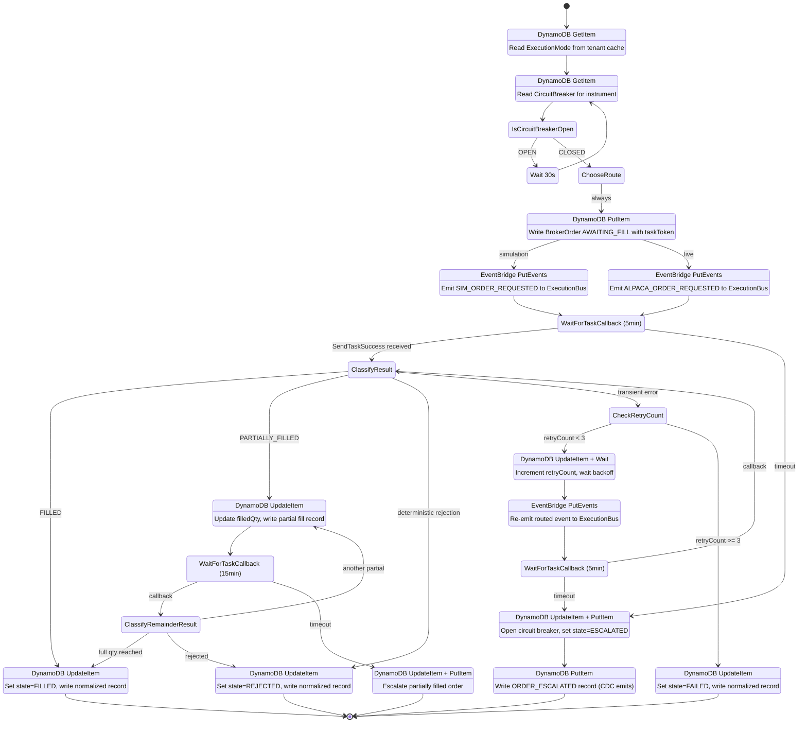
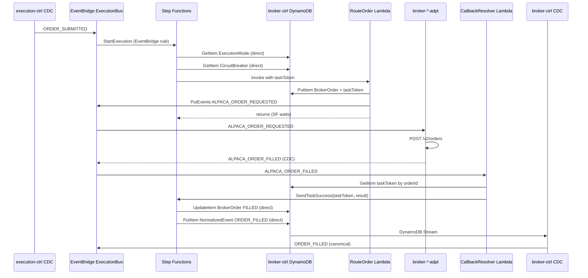

# broker-ctrl Order State Machine — AWS-Native Step Functions Design

Redesign using SF direct service integrations. Goal: minimize Lambda, maximize AWS-native steps.

## Key Insight

Step Functions can directly interact with DynamoDB, EventBridge, and other AWS services without Lambda. The only Lambda needed is a lightweight **callback resolver** (~20 lines) that bridges adapter result events back into the running SF execution via `SendTaskSuccess`.

## Trigger: EventBridge → SF (no Lambda)

```
EventBridge Rule on ExecutionBus:
  detailType: ORDER_SUBMITTED
  target: Step Functions StartExecution
  inputTransformer: maps event detail → SF input
```

Zero Lambda for the trigger. EventBridge natively starts a new SF Standard Workflow execution per order.

## SF Input Shape

```json
{
  "tenantId": "t-123",
  "orderId": "ord-456",
  "symbol": "AAPL",
  "side": "BUY",
  "type": "MARKET",
  "quantity": 50,
  "limitPrice": null,
  "decisionId": "dec-789",
  "source": "ExecutionBus"
}
```

## State Machine



## Step-by-Step Integration Details

### Step 1: ReadExecutionMode (DynamoDB GetItem — no Lambda)

```json
{
  "Type": "Task",
  "Resource": "arn:aws:states:::dynamodb:getItem",
  "Parameters": {
    "TableName": "${BrokerCtrlTable}",
    "Key": {
      "pk": { "S.$": "States.Format('ExecutionMode#{}', $.tenantId)" },
      "sk": { "S": "ExecutionMode" }
    }
  },
  "ResultPath": "$.executionMode",
  "Next": "ReadCircuitBreaker"
}
```

### Step 2: ReadCircuitBreaker (DynamoDB GetItem — no Lambda)

```json
{
  "Type": "Task",
  "Resource": "arn:aws:states:::dynamodb:getItem",
  "Parameters": {
    "TableName": "${BrokerCtrlTable}",
    "Key": {
      "pk": { "S.$": "States.Format('CircuitBreaker#{}', $.tenantId)" },
      "sk": { "S.$": "States.Format('Instrument#{}', $.symbol)" }
    }
  },
  "ResultPath": "$.circuitBreaker",
  "Next": "IsCircuitBreakerOpen"
}
```

### Step 3: IsCircuitBreakerOpen (Choice — no compute)

```json
{
  "Type": "Choice",
  "Choices": [
    {
      "Variable": "$.circuitBreaker.Item.state.S",
      "StringEquals": "OPEN",
      "Next": "BreakerWait"
    }
  ],
  "Default": "ChooseRoute"
}
```

### Step 4: BreakerWait (Wait — no compute, no cost)

```json
{
  "Type": "Wait",
  "Seconds": 30,
  "Next": "ReadCircuitBreaker"
}
```

### Step 5: WriteBrokerOrder (DynamoDB PutItem — no Lambda)

Writes the BrokerOrder record with the task token for the NEXT step's WaitForTaskCallback.

Note: the task token for the WaitForTaskCallback step is not available yet at this point. We need to restructure — the DDB write that stores the taskToken must happen INSIDE the WaitForTaskCallback step. SF provides the token via `$$.Task.Token` only within the task that uses `.waitForTaskToken`.

**Revised approach**: Use a **Pass state** to write BrokerOrder (without taskToken), then the WaitForTaskCallback step writes the taskToken to DDB as part of its resource invocation. Actually, SF doesn't support this natively.

**Better approach**: Use `events:putEvents.waitForTaskToken` — this emits the EventBridge event AND waits for callback in a single step. The taskToken is available as `$$.Task.Token` and gets written to DDB by a single lightweight Lambda that both stores the token and emits the event.

Actually, the cleanest approach: **one Lambda that combines "store taskToken + emit event"**, everything else is direct integration.

### Revised Step 5+6: RouteAndWait (Lambda + waitForTaskToken)

This is the ONE Lambda in the main flow. It:
1. Writes BrokerOrder to DDB (with taskToken)
2. Emits routed event to EventBridge
3. Returns (SF enters wait state)

```json
{
  "Type": "Task",
  "Resource": "arn:aws:states:::lambda:invoke.waitForTaskToken",
  "Parameters": {
    "FunctionName": "${RouteOrderFn}",
    "Payload": {
      "order.$": "$",
      "executionMode.$": "$.executionMode.Item.mode.S",
      "taskToken.$": "$$.Task.Token"
    }
  },
  "TimeoutSeconds": 300,
  "ResultPath": "$.adapterResult",
  "Next": "ClassifyResult",
  "Catch": [
    {
      "ErrorEquals": ["States.Timeout"],
      "Next": "HandleTimeout"
    }
  ]
}
```

### Step 7: ClassifyResult (Choice — no compute)

```json
{
  "Type": "Choice",
  "Choices": [
    {
      "Variable": "$.adapterResult.status",
      "StringEquals": "FILLED",
      "Next": "MarkFilled"
    },
    {
      "Variable": "$.adapterResult.status",
      "StringEquals": "PARTIALLY_FILLED",
      "Next": "MarkPartialFill"
    },
    {
      "Variable": "$.adapterResult.failureClass",
      "StringEquals": "transient",
      "Next": "CheckRetryCount"
    }
  ],
  "Default": "MarkRejected"
}
```

### Step 8: MarkFilled (DynamoDB UpdateItem + PutItem — no Lambda)

Two DDB operations in a Parallel state:
1. UpdateItem: set BrokerOrder state=FILLED
2. PutItem: write normalized ORDER_FILLED record → CDC picks up and emits to EventBridge

```json
{
  "Type": "Parallel",
  "Branches": [
    {
      "StartAt": "UpdateBrokerOrderFilled",
      "States": {
        "UpdateBrokerOrderFilled": {
          "Type": "Task",
          "Resource": "arn:aws:states:::dynamodb:updateItem",
          "Parameters": {
            "TableName": "${BrokerCtrlTable}",
            "Key": {
              "pk": { "S.$": "States.Format('BrokerOrder#{}#{}', $.tenantId, $.orderId)" },
              "sk": { "S": "BrokerOrder" }
            },
            "UpdateExpression": "SET #st = :s, filledQty = :fq, lastUpdateAt = :t",
            "ExpressionAttributeNames": { "#st": "state" },
            "ExpressionAttributeValues": {
              ":s": { "S": "FILLED" },
              ":fq": { "N.$": "States.Format('{}', $.adapterResult.filledQty)" },
              ":t": { "S.$": "$$.State.EnteredTime" }
            }
          },
          "End": true
        }
      }
    },
    {
      "StartAt": "WriteNormalizedFill",
      "States": {
        "WriteNormalizedFill": {
          "Type": "Task",
          "Resource": "arn:aws:states:::dynamodb:putItem",
          "Parameters": {
            "TableName": "${BrokerCtrlTable}",
            "Item": {
              "pk": { "S.$": "States.Format('NormalizedEvent#{}#{}', $.tenantId, $.orderId)" },
              "sk": { "S": "ORDER_FILLED" },
              "__typename": { "S": "NormalizedEvent" },
              "tenantId": { "S.$": "$.tenantId" },
              "orderId": { "S.$": "$.orderId" },
              "symbol": { "S.$": "$.symbol" },
              "side": { "S.$": "$.side" },
              "filledQuantity": { "N.$": "States.Format('{}', $.adapterResult.filledQty)" },
              "averageFillPrice": { "N.$": "States.Format('{}', $.adapterResult.averageFillPrice)" },
              "executionMode": { "S.$": "$.executionMode.Item.mode.S" }
            }
          },
          "End": true
        }
      }
    }
  ],
  "End": true
}
```

CDC on broker-ctrl's DDB table picks up the NormalizedEvent insert and emits `ORDER_FILLED` to ExecutionBus. No Lambda, no direct EventBridge call.

### Retry: Wait + DynamoDB + EventBridge (no Lambda)

```json
{
  "Comment": "Retry loop — entirely Lambda-free",
  "StartAt": "IncrementRetryCount",
  "States": {
    "IncrementRetryCount": {
      "Type": "Task",
      "Resource": "arn:aws:states:::dynamodb:updateItem",
      "Parameters": {
        "TableName": "${BrokerCtrlTable}",
        "Key": { "...": "BrokerOrder key" },
        "UpdateExpression": "SET retryCount = retryCount + :one",
        "ExpressionAttributeValues": { ":one": { "N": "1" } }
      },
      "Next": "ComputeBackoff"
    },
    "ComputeBackoff": {
      "Type": "Choice",
      "Choices": [
        { "Variable": "$.retryState.count", "NumericEquals": 1, "Next": "Wait5s" },
        { "Variable": "$.retryState.count", "NumericEquals": 2, "Next": "Wait15s" },
        { "Variable": "$.retryState.count", "NumericEquals": 3, "Next": "Wait45s" }
      ],
      "Default": "Wait5s"
    },
    "Wait5s":  { "Type": "Wait", "Seconds": 5, "Next": "ReEmitRoutedEvent" },
    "Wait15s": { "Type": "Wait", "Seconds": 15, "Next": "ReEmitRoutedEvent" },
    "Wait45s": { "Type": "Wait", "Seconds": 45, "Next": "ReEmitRoutedEvent" },
    "ReEmitRoutedEvent": {
      "Type": "Task",
      "Resource": "arn:aws:states:::events:putEvents",
      "Parameters": {
        "Entries": [
          {
            "Source": "broker-ctrl",
            "EventBusName": "${ExecutionBus}",
            "DetailType.$": "$.routedEventType",
            "Detail.$": "States.JsonToString($.routedPayload)"
          }
        ]
      },
      "Next": "WaitForRetryResult"
    }
  }
}
```

Wait states are free on Standard Workflows. DynamoDB UpdateItem and EventBridge PutEvents are direct integrations. Zero Lambda in the retry path.

## Callback Resolver (the ONLY Lambda)

One EventBridge rule catches ALL adapter result events and routes to a single Lambda:

```
EventBridge Rule on ExecutionBus:
  detailType:
    - SIM_ORDER_FILLED
    - SIM_ORDER_REJECTED
    - ALPACA_ORDER_FILLED
    - ALPACA_ORDER_PARTIALLY_FILLED
    - ALPACA_ORDER_REJECTED
    - ALPACA_ORDER_PLACED
    - ALPACA_ORDER_CANCELLED
    - ALPACA_ORDER_CANCEL_FAILED
  target: CallbackResolverLambda
```

```typescript
// callback-resolver.ts — ~25 lines
export async function handler(event: EventBridgeEvent) {
  const { tenantId, orderId } = event.detail;

  // Read taskToken from BrokerOrder
  const record = await ddb.get({
    pk: `BrokerOrder#${tenantId}#${orderId}`,
    sk: 'BrokerOrder',
  });

  if (!record?.fillTaskToken) {
    console.warn('No active taskToken for order', orderId);
    return;
  }

  // Resume the SF execution
  await sfn.sendTaskSuccess({
    taskToken: record.fillTaskToken,
    output: JSON.stringify({
      status: mapEventToStatus(event.detail.detailType),
      filledQty: event.detail.filledQuantity,
      averageFillPrice: event.detail.averageFillPrice,
      failureClass: event.detail.failureClass,
      failureReason: event.detail.failureReason,
    }),
  });
}
```

## Lambda Count Comparison

| Concern | Previous SF design | AWS-native SF design |
|---------|-------------------|---------------------|
| SF trigger | Lambda | EventBridge rule (no Lambda) |
| Read execution mode | Lambda | DynamoDB GetItem |
| Read circuit breaker | Lambda | DynamoDB GetItem |
| Route + emit + write DDB | 3 Lambdas | 1 Lambda (RouteOrder — stores taskToken + emits) |
| Wait for callback | (same) | (same) |
| Classify result | Lambda | Choice state |
| Write BrokerOrder state | Lambda | DynamoDB UpdateItem |
| Write normalized event | Lambda | DynamoDB PutItem (CDC emits) |
| Retry increment | Lambda | DynamoDB UpdateItem |
| Retry wait | SF Wait | SF Wait |
| Retry re-emit | Lambda | EventBridge PutEvents |
| Open circuit breaker | Lambda | DynamoDB UpdateItem |
| Callback resolver | Lambda | Lambda |
| **Total Lambdas** | **8-10 per execution** | **2 (RouteOrder + CallbackResolver)** |

## Full Architecture



## Honest Assessment

### What this buys over the previous SF design

- **2 Lambdas instead of 8-10**: Massive reduction. Most logic is declarative in ASL.
- **Retry loop is entirely Lambda-free**: DDB update + Wait + EventBridge put — all direct integrations.
- **Normalization via CDC instead of Lambda**: SF writes a `NormalizedEvent` record to DDB, CDC pipeline emits it. Consistent with the rest of the architecture.
- **Trigger is Lambda-free**: EventBridge → SF directly.
- **Circuit breaker check is Lambda-free**: DDB GetItem + Choice state.

### What this buys over Lambda+DDB (the original spec design)

- **Visual execution history**: Every order's full lifecycle in the SF console.
- **Declarative timeouts and retries**: No separate SF Express executions.
- **Atomic state transitions**: SF guarantees exactly-once per step.
- **Two Lambdas total** (RouteOrder + CallbackResolver) vs. a single event-listener Lambda with complex branching logic. The SF approach is actually SIMPLER code — each Lambda does one thing.

### Remaining pain points

- **CDK verbosity**: The ASL definition is verbose (though CDK's `sfn.Chain` API helps).
- **Standard Workflow cost**: ~$0.025 per 1000 transitions. Still negligible for personal use.
- **DDB still required**: For taskToken storage, BrokerOrder read model, circuit breaker state. SF doesn't eliminate DDB — it changes how you interact with it.
- **Cancel flow still needs parallel branch**: Same complexity as before.
- **Testing**: Harder to unit test than a pure Lambda. Need `stepfunctions-local` or integration tests.
- **Debugging ASL**: When something goes wrong in a DDB expression or Choice condition, the error messages from SF are less helpful than a Lambda stack trace.

### Verdict change from previous design

The AWS-native approach significantly changes the trade-off. With only 2 Lambdas, the SF design is:
- **Less code to maintain** than the Lambda+DDB approach (which needs a complex event-listener with state machine logic)
- **More observable** (SF console vs. CloudWatch logs)
- **More declarative** (ASL vs. imperative TypeScript)

The previous SF design (8-10 Lambdas) was worse than Lambda+DDB. This native design (2 Lambdas) is arguably better — at the cost of CDK verbosity and ASL learning curve.
