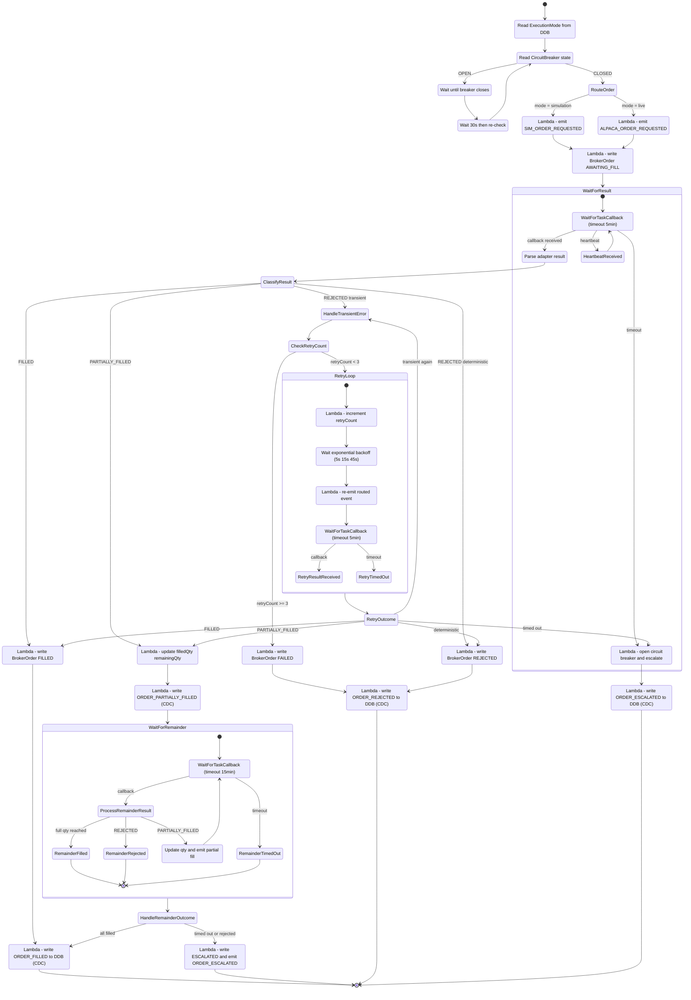
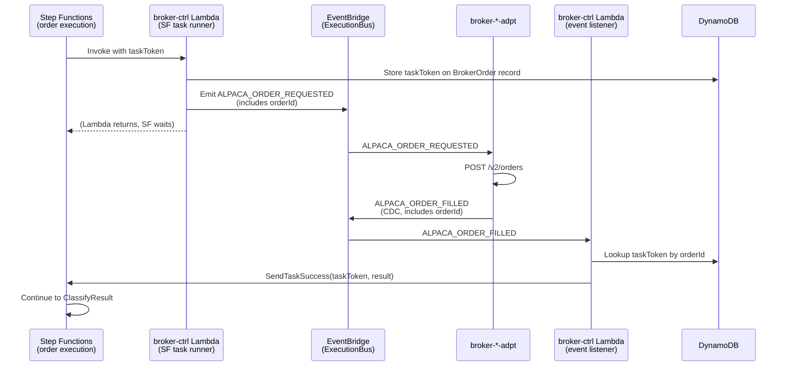
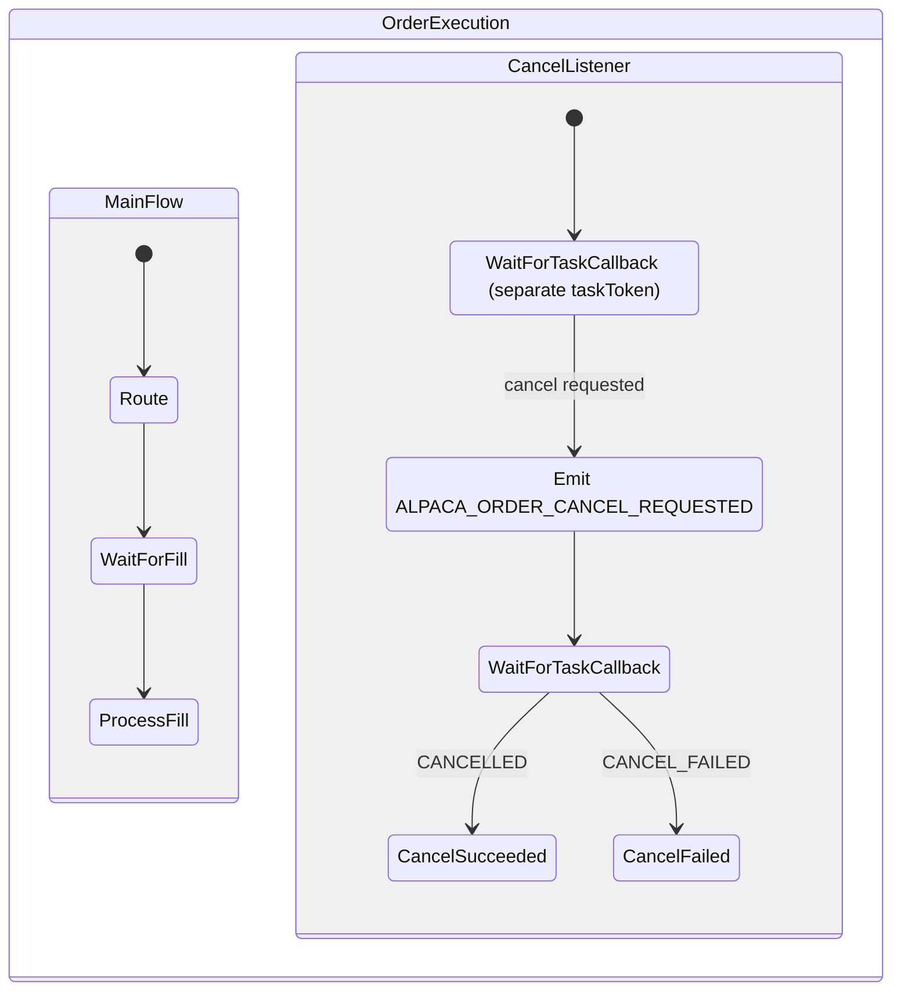

# broker-ctrl Order State Machine — Step Functions Design

Exploratory design for implementing the broker-ctrl order state machine as a Step Functions Standard Workflow.

## Overview

One SF execution per order. Started when `ORDER_SUBMITTED` arrives. The SF orchestrates routing, fill tracking, retries, timeouts, and normalization. DynamoDB is still used as a queryable read model (BrokerOrder entity).

## State Machine



## Task Token Flow

The critical integration point: how does an async EventBridge event callback into a running SF execution?



### Key: taskToken stored in DDB, not in the event payload

The task token is NOT passed through the adapter. Instead:
1. SF invokes Lambda with `taskToken` in the context
2. Lambda stores `taskToken` on the `BrokerOrder` DDB record (keyed by orderId)
3. When the result event arrives, the event-listener Lambda looks up the `taskToken` from DDB by orderId
4. Lambda calls `SendTaskSuccess(taskToken, result)` to resume SF

This avoids coupling adapters to SF task tokens — adapters remain thin and unaware of orchestration.

## Cancel Flow (Parallel Branch)

Cancellation can arrive at any point while the order is in `AWAITING_FILL` or `PARTIALLY_FILLED`. This is handled by a **parallel SF branch** that listens for cancel requests.



This requires storing TWO task tokens per order in DDB:
- `fillTaskToken` — for fill/rejection results
- `cancelTaskToken` — for cancel results

When cancel succeeds, the parallel branch completes and the main flow is terminated.

## DDB Entity (updated for SF)

```
pk: BrokerOrder#{tenantId}#{orderId}
sk: BrokerOrder

{
  tenantId, orderId, executionMode,
  state: ROUTING | AWAITING_FILL | FILLED | PARTIALLY_FILLED | REJECTED | FAILED | ESCALATED | CANCEL_REQUESTED | CANCELLED,
  routedTo: 'sim' | 'alpaca',
  alpacaOrderId: string | null,

  // SF integration
  sfExecutionArn: string,
  fillTaskToken: string | null,     // active WaitForCallback token for fills
  cancelTaskToken: string | null,   // active WaitForCallback token for cancel

  // fill tracking
  requestedQty, filledQty, remainingQty,
  fills: [{ qty, price, timestamp }],

  // failure tracking
  retryCount: number,
  lastFailureReason: string,
  failureClass: 'transient' | 'deterministic' | 'ambiguous',

  instrumentId: string,
  routedAt, lastUpdateAt, timeoutAt
}
```

## Honest Assessment

### What this design reveals

**Gains over Lambda+DDB:**
- Timeout handling is elegant — `WaitForTaskCallback` with timeout replaces separate SF Express executions
- Retry backoff is declarative — `Wait` states with increasing durations, loop naturally
- Partial fill tracking is a clean loop — not scattered across multiple Lambda invocations
- Cancel as parallel branch is expressive — captures the real concurrency model
- Full execution history in SF console — every state transition recorded, debuggable

**Pain points:**
- **Two task tokens per order** — fill and cancel are concurrent concerns, each needs its own callback
- **DDB is still required** — for task token lookup (mapping orderId → taskToken) and queryable read model
- **Lambda count increases** — each SF state that "does something" is a Lambda invocation. Route (1) + emit (1) + write DDB (1) + normalize (1) = 4+ Lambdas per happy path, vs. 1-2 in the event-driven approach
- **Circuit breaker polling loop** — the `QueuedWait → re-check` loop in SF is clunky compared to event-driven "resume when breaker closes"
- **Standard Workflow cost** — ~$0.025 per 1000 transitions. An order with retries might hit 15-20 transitions. Still cheap for personal use.
- **CDK verbosity** — defining this in CDK is significantly more code than the Lambda+DDB approach

### When SF would clearly win

- High order volume where visual debugging matters
- Complex order types (bracket orders, OCO, multi-leg) where the state machine grows
- Regulatory audit requirements (SF provides immutable execution history)

### When Lambda+DDB clearly wins

- Low volume personal use
- Simpler testing (unit test Lambdas in isolation)
- Fewer moving parts
- Consistent with the rest of the event-driven architecture
