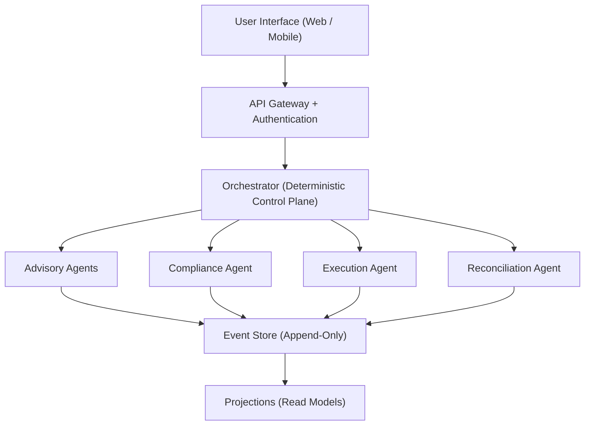

# System Architecture

High-level architectural design for Nestfolio, an AI-managed investment platform that acts as a digital financial coach for novice investors.

> [Back to Index](../README.md)

## Documents in This Section

- [Agent System](./agent-system.md) -- AI agent topology, decision lifecycle, reasoning model, and compliance validation
- [Portfolio Management](./portfolio-management.md) -- Portfolio operations, rebalancing, execution flow, and broker integration

---

## System Goals

Nestfolio's architecture is designed to satisfy six core objectives:

| Goal | Description |
|---|---|
| Automated portfolio lifecycle | End-to-end management from goal setting through trade execution and reporting |
| Trust-first user experience | Transparent decisions with plain-language explanations at every step |
| Explainable AI decisions | Every action traceable to stored reasoning factors and auditable artifacts |
| Regulatory auditability | Immutable decision records, deterministic replay, and compliance boundaries |
| Localization-first design | Multi-language, multi-currency support embedded from inception |
| Scalable multi-agent backend | Horizontally scalable agents activated on demand, decoupled from user count |

---

## System Domains

The platform is organized into five logical domains. Each domain encapsulates a distinct area of responsibility and maps to one or more services in the runtime architecture.

### User Experience Domain

Manages all user-facing interactions:

- Conversational onboarding and goal capture
- Portfolio dashboard and performance views
- Actionable recommendations and nudges
- Explainability views ("why did this happen?")
- Notification delivery and user preferences

See [UI/UX Specification](../08-ui-ux/README.md) for detailed design.

### AI Advisory Domain

Houses the intelligence layer responsible for investment reasoning:

- Goal interpretation and timeline modeling
- Risk profiling and suitability assessment
- Portfolio strategy formulation
- Rebalancing decision generation
- Recommendation and explanation synthesis

See [Agent System](./agent-system.md) for the full agent topology and decision lifecycle.

### Execution Domain

Translates authorized decisions into real-world actions:

- Order generation from approved trade plans
- Broker integration via Interactive Brokers (IBKR)
- Trade execution with idempotency guarantees
- Position synchronization and reconciliation

See [Portfolio Management](./portfolio-management.md) for execution flow and broker integration details.

### Compliance and Trust Domain

Enforces regulatory alignment and decision integrity:

- Decision audit trails with immutable artifacts
- Model explainability and reasoning persistence
- Activity logging across all system operations
- User consent tracking and mandate governance

See [Governance and Compliance](../06-governance-compliance.md) for the full compliance framework.

### Platform Infrastructure Domain

Provides underlying technical capabilities shared across domains:

- Identity, authentication, and tenant isolation
- Data storage (event store, projections, secrets)
- Event processing and agent orchestration
- Localization services

---

## Core Architectural Principles

Five principles govern all architectural decisions:

1. **Event-driven system** -- All state changes propagate as immutable events. The event store is the system of record. See [Event-Driven Architecture](../03-event-driven-architecture.md) for details.

2. **Agent-based orchestration** -- Specialized AI agents perform analysis and propose actions. A deterministic orchestrator coordinates workflows and enforces step ordering.

3. **Human-readable decision layer** -- Every portfolio-impacting action produces a Decision Packet containing structured reasoning factors, compliance checks, and plain-language explanations.

4. **Separation of advice and execution** -- Advisory agents cannot execute trades. Only the Execution Agent, after compliance authorization, can submit orders to the broker.

5. **Deterministic audit replay** -- Decisions are reproducible from stored feature snapshots and policy hashes. Historical intent is never altered by model upgrades.

---

## High-Level Topology

The system operates as a governed multi-agent architecture with four tiers:

**Orchestrator** -- Owns workflow state machines and timing. Routes events to agents, enforces step ordering and idempotency, and produces canonical Decision Packets.

**Advisory Agents** -- Stateless, event-activated agents that perform analysis: goal interpretation, risk profiling, market research, portfolio construction, rebalance planning, and explanation generation. These agents propose actions but cannot execute them.

**Compliance Agent** -- Validates every proposed action against mandate scope, suitability constraints, guardrail thresholds, and regulatory rules. Generates immutable audit artifacts. Can escalate to human review.

**Execution Agent** -- The sole component authorized to submit orders to Interactive Brokers. Operates under the Single Writer Principle.

**Reconciliation Agent** -- Continuously compares internal portfolio projections against broker settlement truth. Detects drift and triggers safe correction workflows.

See [Service Decomposition](../04-service-decomposition/README.md) for the full service taxonomy and deployment architecture.

---

## Decision Authority Model

Nestfolio operates under a **Hybrid Delegated Mandate Model**. Users grant a scoped discretionary mandate during onboarding. The AI system may autonomously execute investment actions within predefined guardrails, while certain actions remain user-controlled.

### Authority Levels

| Level | Name | Scope | Examples |
|---|---|---|---|
| L0 | Informational | No execution impact | Portfolio insights, market explanations, progress updates |
| L1 | Autonomous (Pre-Authorized) | Within mandate guardrails | Rebalancing within risk band, drift correction, dividend reinvestment, tax-efficient adjustments |
| L2 | User Confirmation Required | Outside autonomous scope | Strategy change, risk profile modification, large allocation shifts, withdrawal recommendations |
| L3 | User Exclusive | User-initiated only | Deposits, withdrawals, account closure, mandate revocation |

Actions automatically escalate from L1 to L2 when:

- Allocation change exceeds the operating mode's risk band
- Trade exceeds maximum trade size
- Monthly turnover cap would be breached
- Portfolio drawdown exceeds circuit breaker threshold
- Strategy model changes allocation class
- User mandate or risk profile mismatch detected

---

## Operating Modes and Guardrails

Three configurable operating modes determine autonomy thresholds, risk tolerances, and user confirmation requirements.

| Parameter | Conservative | Balanced (Default) | Aggressive |
|---|---|---|---|
| Equity Risk Band | +/-3% | +/-6% | +/-10% |
| Drift Trigger | 2% | 4% | 7% |
| Max Trade Size | 5% of portfolio | 10% of portfolio | 20% of portfolio |
| Rebalance Cadence | Quarterly | Monthly | Bi-Weekly |
| Monthly Turnover Cap | 10% | 25% | 50% |
| Single ETF Concentration | 20% | 30% | 40% |
| Illiquid Assets | Not allowed | Limited | Allowed (screened) |
| Volatility Pause Trigger | High | Medium | Extreme |
| Drawdown Circuit Breaker | -8% | -12% | -18% |
| Instrument Cool-Down | 10 trading days | 5 trading days | 2 trading days |

Mode selection occurs during onboarding and can be changed later. Mode changes are L2 actions (user confirmation required). The Compliance Agent validates that the selected mode is compatible with the user's risk profile and mandate.

Each mode defines a policy bundle covering: risk bands, drift thresholds, max turnover, max order size, confirmation escalation thresholds, cool-down rules, and circuit breakers.

---

## Multi-Tenant Architecture

Every request and backend action is scoped to a **tenant_id**.

### Identity and Authorization

- Users authenticate and receive a JWT containing a `tenant_id` custom claim
- Services and agents extract `tenant_id` and apply it as a required scope
- Authorization checks occur at the API boundary, orchestrator workflows, event store paths, and projection reads

### Resource Partitioning

Tenant isolation is enforced across:

- Event streams
- Projection stores
- Order and decision artifacts
- Notification and messaging records
- Secrets and broker credentials

All resource keys include or map to `tenant_id`.

### IAM Attribute-Based Access Control

Nestfolio uses **ABAC** to constrain access to tenant partitions:

- Principal/session attributes include `tenant_id`
- Resource tags include `tenant_id`
- Dynamic policies enforce that principal `tenant_id` must match resource `tenant_id`

This applies to both user-initiated and system-initiated workflows, including AgentCore invocations, orchestrator routing, and execution operations.

See [Governance and Compliance](../06-governance-compliance.md) for the full security model, operational roles, and IBKR credential isolation.

---

## Observability Overview

Nestfolio implements institutional-grade observability extending beyond infrastructure monitoring to include AI behavior, financial safety, and decision quality.

### Observability Layers

| Layer | Key Metrics |
|---|---|
| Infrastructure | Agent invocation latency, error rates, streaming connection health, queue depth, service availability |
| Operational AI | Agent success/failure rates, decision throughput, execution latency, retry frequency, context bundle size trends |
| Financial Safety | Portfolio drift frequency, reconciliation mismatch rate, order rejection ratio, circuit breaker activations, turnover pressure |
| Decision Quality | Guardrail proximity, strategy deviation, allocation volatility, trade clustering, model divergence vs. shadow models |

### AI Health Indicators

Derived metrics provide early warning signals:

- **Decision Stability Index** -- Measures consistency of decisions across similar conditions
- **Guardrail Pressure Index** -- Tracks how close decisions are to guardrail boundaries
- **Reconciliation Confidence Score** -- Quantifies agreement between internal projections and broker truth
- **Model Agreement Score** -- Compares production model behavior against shadow candidates

Threshold breaches emit operational alerts and may trigger automated safety responses.

### Monitoring Dashboards

Three separate visibility planes serve different operational needs:

- **Operations Dashboard** -- System health, performance, and infrastructure status
- **Compliance Dashboard** -- Audit events, mandate adherence, and regulatory reporting
- **AI Governance Dashboard** -- Model performance, shadow divergence, and promotion readiness

See [Operations and Deployment](../07-operations-deployment.md) for incident response, automated safety responses, and production launch controls.
