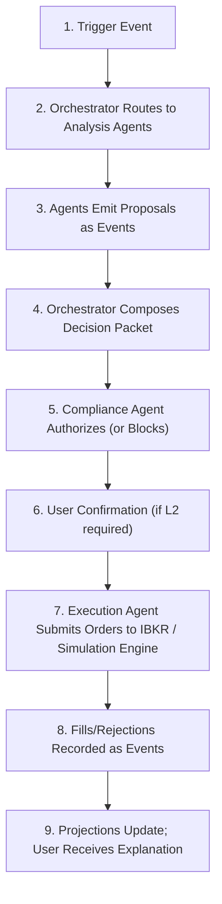

# Agent System

AI agent topology, decision lifecycle, reasoning model, and compliance validation for the Nestfolio platform.

> [Back to Index](../README.md) | [Section Overview](./README.md)

---

## Agent Topology

Nestfolio uses a **Governed Multi-Agent Architecture**. Specialized agents perform analysis and propose actions. A deterministic orchestrator coordinates workflows. A compliance control layer authorizes or blocks any action that could impact execution. Only the Execution Agent can place orders, and only after authorization.

### Orchestrator (Deterministic Control Plane)

The Orchestrator is the central coordinator of all agent workflows:

- Owns workflow state machines and timing cadence
- Routes events to the appropriate agents
- Enforces step ordering and idempotency
- Produces canonical Decision Packets for audit
- Builds Context Bundles for each agent invocation
- Maintains processed-event checkpoints per stream

The Orchestrator is a persistent control service that remains continuously available. It does not perform AI reasoning -- it applies deterministic routing and sequencing logic.

### Specialized Intelligence Agents

These agents perform analysis and generate proposals but cannot execute trades:

| Agent | Responsibility |
|---|---|
| User and Goals Agent | Goal interpretation, timeline modeling, constraint extraction |
| Risk Agent | Risk profiling, risk band calculation, guardrails evaluation |
| Market and Research Agent | Market signals, regime detection, watchlist management |
| Portfolio Construction Agent | Target allocation, instrument selection, strategy formulation |
| Rebalance Planner Agent | Trade plan generation, cost estimation, impact analysis |
| Recommendation and Explainability Agent | Plain-language outputs, UX narratives, explanation synthesis |

All intelligence agents are:

- **Stateless** across invocations -- no internal memory between calls
- **Event-activated** -- instantiated on demand in response to events
- **Horizontally scalable** -- multiple instances can process different portfolios concurrently
- **Idempotent** -- processing the same event twice produces the same result

### Compliance Agent (Authorizer)

The Compliance Agent is the mandatory gate between advisory reasoning and trade execution:

- Validates every proposed action against mandate scope, suitability constraints, and guardrail thresholds
- Generates immutable audit artifacts for every decision
- Can escalate to human review when confidence is insufficient or regulatory rules require it
- Enforces level escalation rules (L1 to L2) when actions exceed autonomous scope

The Compliance Agent validates reasoning completeness before permitting execution. No trade can proceed without explicit compliance authorization.

### Execution Agent (Single Writer)

The Execution Agent is the sole component authorized to submit orders. It operates identically regardless of account mode -- it submits orders to `execution-adpt`, which routes them to Interactive Brokers (Live) or the simulation engine (Simulation). The Execution Agent itself has no mode-specific logic:

- Submits, modifies, and cancels orders via `execution-adpt`
- Tracks order status through the full lifecycle
- Operates under the Single Writer Principle -- no other agent or service can submit orders
- Verifies safety checks before every submission: no active reconciliation lock, no pending conflicting staged orders, turnover limits respected, market liquidity checks pass

### Reconciliation Agent

Continuously compares internal portfolio projections against broker settlement truth:

- Detects drift between expected and actual positions
- Emits reconciliation events when mismatches are found
- Triggers safe correction workflows
- Prevents duplicate execution during drift resolution

See [Portfolio Management](./portfolio-management.md) for reconciliation cadence and recovery flows.

---

## Agent Memory Model

Agents do not independently query system state. Instead, the Orchestrator prepares a curated **Context Bundle** containing all required inputs for each invocation.

### Context Bundle Contents

Each agent invocation receives:

- **Triggering event** -- The event that initiated the workflow
- **Decision ID** -- Reference to the Decision Packet being constructed (if applicable)
- **Portfolio projection snapshot** -- Current holdings, cash, performance, and drift metrics
- **Mandate context** -- User mandate scope, limits, and operating mode
- **Guardrail policy** -- Mode-derived parameter set (risk bands, thresholds, caps)
- **Market signals** -- Relevant market data for the decision context
- **Prior decision references** -- Bounded window of recent decisions for continuity
- **Feature snapshot** -- Key inputs used for the decision
- **Model and policy versions** -- Exact versions of models and policies in effect
- **Account mode** -- `SIMULATION` or `LIVE`. Included so the Recommendation and Explainability Agent can frame explanations appropriately (e.g., "In your simulation portfolio..." vs "In your portfolio..."). Account mode does not alter agent reasoning, compliance checks, or decision logic -- it is a presentational signal only.

### Context Bundle Principles

- **Deterministic** -- Same inputs produce same outputs for audit replay
- **Minimal** -- Contains only the information necessary for the specific agent
- **Immutable** -- Bundle contents are frozen once generated
- **Cost-contained** -- Context window bounded per agent type; historical data accessed via summarized projections to prevent inference cost growth with account age

The Context Bundle hash is stored in the Decision Packet, enabling deterministic audit replay by reproducing equivalent reasoning factors from the same bundle.

---

## Decision Lifecycle

Every portfolio-impacting change follows a nine-step lifecycle:

### Trigger Sources

The lifecycle can be initiated by:

- **Event-driven triggers** -- Deposit confirmed, goal or risk profile change, portfolio drift detected, order filled/rejected, volatility circuit breaker trip, data feed recovery
- **Scheduled cycles** -- Daily portfolio health check, daily reconciliation (IBKR or virtual ledger), weekly risk review, monthly strategic rebalance review, monthly report generation

This hybrid cadence ensures responsiveness to real-time events while maintaining consistent coverage through scheduled routines.

### Decision Packet

The Decision Packet is the orchestrator's canonical artifact for any portfolio-impacting change. It is immutable once created and fully auditable.

| Field | Description |
|---|---|
| `decision_id` | Unique identifier (UUID) |
| `user_id` | Tenant/user reference |
| `trigger` | Event references and timestamps that initiated the decision |
| `portfolio_context` | Projection version and key metrics at decision time |
| `mandate_context` | Mandate ID, scope, and limits in effect |
| `proposed_actions` | One or more action plans generated by advisory agents |
| `trade_plan` | Candidate orders with quantities and constraints |
| `risk_checks` | Pre/post risk band analysis and stress checks |
| `cost_checks` | Fee estimates, slippage estimates, tax impact estimates |
| `explainability_factors` | Structured, human-readable factor list |
| `required_authority_level` | L0 through L3 classification |
| `compliance_decision` | Approved or blocked, with reasons |
| `execution_outcome` | Filled, rejected, or cancelled, with broker references |

All agent outputs within a Decision Packet are referenced by event IDs. Replays must recreate the same Decision Packet for the same inputs within deterministic constraints.

---

## AI Reasoning Persistence

Nestfolio adopts a **Dual Layer Reasoning Model** that preserves auditable decision intent at execution time while allowing safe regeneration of richer explanations later.

### Stored Artifacts (at Decision Time)

For each Decision Packet, the system persists:

- **Reasoning Factors** -- Structured, non-chain-of-thought factors that explain the decision (e.g., "Equity drift exceeded risk band", "Goal horizon: long-term", "Expected risk-adjusted improvement")
- **Feature Snapshot** -- Key inputs used for the decision
- **Model Metadata** -- Model ID, version, and policy set
- **Prompt/Policy Hash** -- Immutable reference to the exact prompts and policies used
- **Decision Hash** -- Deterministic integrity check

Raw chain-of-thought is **not stored**. PII is minimized within reasoning factors.

### Explanation Generation

Two modes are supported:

- **Deterministic (Default)** -- Explanations reconstructed directly from stored reasoning factors. Instant, replayable, and audit-safe.
- **Adaptive (Enhanced)** -- LLM generates natural-language explanation using stored factors as bounded context. Cannot introduce facts outside the recorded factors.

### Audit and Reproducibility Guarantees

- Decisions are reproducible from stored feature snapshots and policy hashes
- Explanations remain consistent over time regardless of model upgrades
- Model upgrades do not alter historical intent
- All explanation views reference the originating `decision_id`

---

## AI Model Governance

AI model changes are treated as controlled operational events following a four-stage promotion pipeline.

### Promotion Pipeline

| Stage | Description | Execution |
|---|---|---|
| Offline Evaluation | Candidate models evaluated on historical datasets against risk compliance, portfolio stability, turnover impact, decision consistency, and guardrail adherence | None |
| Shadow Mode | Candidate runs in parallel with production model, generating Decision Packets marked as `shadow`. Differences in allocation, trade frequency, and risk exposure are analyzed | None |
| Limited Rollout | Model enabled for a controlled subset of users or portfolios. Compliance monitoring intensified, circuit breakers tightened. Automatic rollback available | Limited |
| Promotion | Model promoted to production after governance approval. Promotion recorded as immutable event. Model version becomes eligible for Decision Packets | Full |

### Model Registry

All models are registered with: model ID, version, training data reference, evaluation results, approval timestamp, and approver identity.

Decision Packets reference model metadata for reproducibility.

### Safety and Rollback

- Previous production model retained for immediate rollback
- Rollback emits a `ModelRollbackTriggered` event
- Active executions paused during rollback if required
- Model upgrades must not alter historical decisions
- Explainability compatibility validated before promotion
- Guardrail compliance validated pre-promotion
- Human approval required for promotion (MVP)

See [Governance and Compliance](../06-governance-compliance.md) for AI governance reviewer roles and approval workflows.

---

## Cost Control for AI Inference

Nestfolio uses **Adaptive Intelligence Scaling** to control inference costs during volatility and growth.

### Budgeting

Budgets are enforced at two levels:

- **Global Budget** -- Overall platform inference ceiling
- **Tenant Budget** -- Per-tenant rate and spend limits

Budget events (`TenantBudgetApproaching`, `TenantBudgetExceeded`, `GlobalBudgetApproaching`, `GlobalBudgetExceeded`) trigger policy changes.

### Reasoning Tiers

Agents operate in one of three tiers, selected dynamically based on operating mode, budget health, volatility conditions, and incident state:

| Tier | Description |
|---|---|
| Tier 0 (Minimal) | Rule-based checks and deterministic projections only |
| Tier 1 (Standard) | Normal agent reasoning using full Context Bundle |
| Tier 2 (Deep) | Expanded analysis, richer market context, scenario evaluation |

Smaller, cheaper models are used for Tier 0-1 reasoning where possible. Larger models are reserved for Tier 2 when justified. Explainability generation can be downgraded to deterministic factor-based output under load.

### Throttling Under Volatility

To prevent cost spikes:

- Market-driven triggers are debounced
- Duplicate trigger events are merged within time windows
- Per-tenant invocation rate limits are enforced

### Degraded Mode

When budgets are exceeded, the system enters degraded mode:

- Non-critical analysis paused
- Reconciliation and safety checks continue
- Minimal user explanations provided
- Only critical events escalated

All degradations are event-logged for audit.
