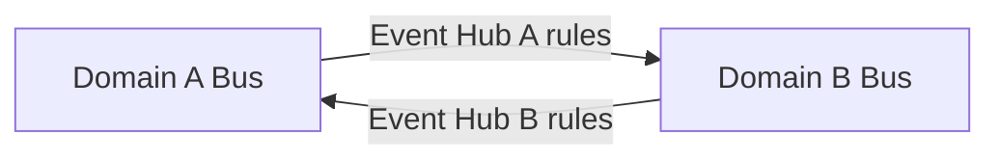
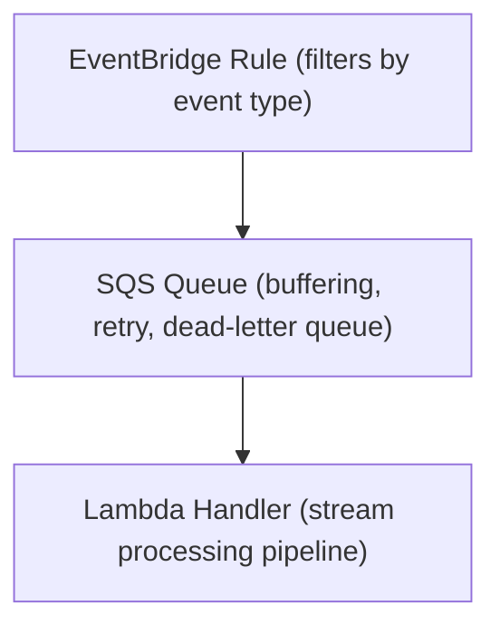

# Event-Driven Architecture

Formalizes the architectural patterns and design decisions that govern every backend service in Nestfolio. This document is domain-agnostic and applies uniformly when designing, building, or extending any domain.

> [Back to Index](./README.md)

---

## Service Taxonomy

Every service is classified by its architectural role. The suffix in the service name encodes this role, making the system's topology self-documenting.

### BFF -- Backend for Frontend

A BFF exposes an API consumed by a specific frontend feature for a specific actor. It owns the read/write path for a single bounded context.

**One BFF = one feature = one actor.** Each BFF is scoped to serve exactly one frontend capability for one type of consumer. Adding a feature means adding a BFF; removing a feature means removing one. No shared BFF serves multiple unrelated features or multiple actor types. Each BFF is small, focused, independently deployable, and disposable without side effects on the rest of the system.

Each BFF typically includes and delivers a **microfrontend** -- the UI component that corresponds to its feature. The BFF and its microfrontend form a **vertical slice**: API, business logic, state, and UI for a single feature are co-owned and co-deployed. A frontend host application loads microfrontends at runtime, composing the user interface from independently delivered feature modules backed by their own BFFs.

A BFF may own stateful resources (database tables, object storage) when it is the authoritative source for its bounded context. It publishes domain events for state changes that other services need to react to.

### CTRL -- Controller

A Controller implements **asynchronous processing pipelines** triggered by domain events. It has no API surface -- it reacts to events, performs multi-step transformations or orchestrations, and emits new higher-level domain events.

Controllers are where cross-aggregate coordination happens. They consume events from one or more sources, apply business logic (enrichment, aggregation, re-partitioning, state materialization), and publish the results as new domain events. A controller may own stateful resources when it needs to accumulate or materialize state across multiple incoming events.

| Signal in Requirements | Controller Pattern |
|---|---|
| Multi-step workflow that must complete reliably | **Orchestration** (state machine) with sequencing, branching, retry, and error handling |
| Long-running process with external callbacks | **Orchestration with callback patterns** -- the state machine waits for external completion signals |
| Distributed transaction spanning multiple aggregates | **SAGA pattern** -- local transactions with compensating actions on failure |
| Reaction to events that produces derived state | **Event-driven materialization** (collect, enrich, publish) |
| Heavy computation that would degrade API latency | Isolate from BFF to protect response times |
| Cross-aggregate coordination within the domain | Consume events from multiple BFFs, materialize a higher-level view |

**Performance isolation principle**: Any processing that is computationally expensive, time-consuming, or has unpredictable latency must be extracted into a Controller. The BFF path must remain fast and predictable -- it accepts commands and returns quickly. Heavy work happens asynchronously in controllers.

**Orchestration model**: Controllers that manage multi-step workflows use a state machine as their execution engine. The state machine provides explicit control flow (sequencing, branching, parallelism), built-in retry and error handling, visibility into workflow progress, and the ability to wait for external callbacks. When a workflow must guarantee all-or-nothing semantics across multiple services or aggregates, the Controller implements the SAGA pattern: each step is a local transaction with a corresponding compensating action that undoes its effect if a subsequent step fails.

### ADPT -- Adapter

An Adapter serves as an **anti-corruption layer** that bridges an external dependency into the internal event-driven domain. It translates external protocols, data formats, and interaction patterns into the system's event contract.

Adapters operate in two contexts:

- **External system integration**: Bridging third-party APIs, legacy systems, partner platforms, or cloud services. The adapter isolates external data models, protocols, and failure modes behind a clean boundary. When an external system changes its API or is replaced entirely, only the adapter changes.
- **Inter-domain anti-corruption**: When two sub-systems communicate, an adapter on the consuming side translates the producing domain's event contract into the consuming domain's internal language. It typically defines and deploys the external bus forwarding rules that bring events from the producing domain's bus into the consuming domain's bus.

Adapters may be event-triggered (reacting to internal events that require external calls) or polling-based (watching external systems for changes and publishing internal events).

**Replaceability principle**: Because the adapter encapsulates all external interaction, swapping one external provider for another requires changing only the adapter. The rest of the domain is unaffected.

### Event Hub

An Event Hub is an **event routing service** that owns the EventBridge bus for a domain. It defines forwarding rules that route events across system boundaries.

Event Hubs contain no business logic and no handlers. They are pure infrastructure: a bus definition plus a set of rules that forward matching events to other domain buses. This creates an explicit, auditable map of how events flow between domains. Each domain has exactly one Event Hub.

**Event Archive**: Each Event Hub owns a persistent, per-domain event archive that retains all events published to the domain bus. The archive serves two purposes: **new service onboarding** (a new service can replay historical events to build its initial state) and **failure recovery** (a service that lost state can replay events to resynchronize). The archive provides replay capability scoped by time range and event type filters.

---

## Bus-per-Domain Topology

Each domain owns a **dedicated event bus**. Services within a domain publish to their domain bus. Cross-domain communication happens exclusively through Event Hub forwarding rules -- never by publishing directly to another domain's bus.

This topology enforces domain boundaries at the infrastructure level. A domain controls which events leave its boundary and which external events it accepts. The Event Hub is the single point where cross-domain routing is defined, making inter-domain event flow explicit and centrally governed per domain.



---

## Events-Only Communication

All communication between services -- within a domain and across domains -- happens **exclusively through events on the bus**. There are no synchronous inter-service calls, no REST APIs between services, no RPC, no shared databases, no direct invocations. Every service is a producer, a consumer, or both -- and the event bus is the only channel between them.

This constraint is absolute and applies at every level: between services within the same sub-system, between sub-systems, and between the system and external dependencies (mediated through adapters). It ensures that every service is decoupled in time, availability, and deployment -- a producer does not need its consumers to be running, reachable, or even deployed when it publishes an event.

---

## Event Contract

All events follow a unified schema:

| Field | Description |
|---|---|
| `id` | Unique event identifier |
| `timestamp` | ISO 8601 event time |
| `type` | Event type identifier (the routing key) |
| `subject` | Domain-specific payload; varies per event type |
| `context` | Cross-cutting metadata; always includes tenant scoping |

The **Subject** carries the domain payload. The **Context** carries cross-cutting metadata that every event must include -- at minimum, tenant identification and the identifiers needed to scope the event to its aggregate. Context enables tenant isolation, traceability, and routing without inspecting the domain payload.

### Event Type Ownership

Each service defines and owns its event types. A producing service exports its event type definitions so that consuming services can import them directly. This creates a compile-time contract between producer and consumer -- if the producer changes an event shape, consumers detect the break at build time.

### Event Schema Evolution

Event schemas are never versioned. Instead, the **robustness principle** applies:

- Producers may add new fields to existing events. Consumers must tolerate unknown fields.
- Producers must never introduce breaking changes to existing event schemas.
- When an event's semantics need to change fundamentally, a new event type is created and the old one is deprecated.

This avoids the complexity of version negotiation and keeps consumers resilient by design.

---

## Event Routing Pattern

Events are consumed through a standardized three-tier ingestion pattern:



- **EventBridge rule**: Selects which event types a service cares about.
- **SQS queue**: Provides buffering, at-least-once delivery, and automatic retry with a dead-letter queue for messages that exceed the retry threshold.
- **Lambda handler**: Processes batches of events through a stream processing pipeline.

This pattern decouples event production from consumption, provides back-pressure through SQS buffering, and guarantees that no event is silently lost -- failed events land in the dead-letter queue for inspection and replay.

---

## Service Infrastructure Envelope

Each service has a fixed, minimal infrastructure footprint. For **BFF services**, the API surface is handled by AppSync JS pipeline resolvers (see *BFF API Layer* below), not by a dedicated Lambda function. The Lambda footprint consists of:

- **One event-listener Lambda (ingress)**: A single EventBridge rule → SQS queue (with dead-letter queue) → Lambda handler. All event types the service consumes arrive through this single queue and are dispatched inside the handler via code (`switch`/`case` or `Set.has()`). Event type multiplexing is a code concern, not an infrastructure concern -- creating additional queues or Lambdas for different event types is not permitted.
- **One event-publisher Lambda (egress)** *(when the service publishes domain events)*: A single change-data-capture trigger (DynamoDB Streams or S3 Event Notifications) → Lambda handler that publishes state changes as domain events to the EventBridge bus. This Lambda is provided by the Egress construct and is not written per-service.

The BFF's GraphQL API is served by **AppSync JS pipeline resolvers** that execute directly within AppSync against a DynamoDB data source. No Lambda function is required for the API path unless specific operations demand it (see *BFF API Layer — When Lambda Resolvers Are Required*). When Lambda resolvers are needed for specific fields, a single resolver Lambda handles all Lambda-backed fields.

Not every service requires both event paths. A BFF that serves as a **pure read-model** -- materializing incoming events into query-optimized projections without producing domain events -- has an ingress path but no egress path. It receives events, updates its projections, and exposes them via its API surface. Since it does not publish state changes, no Egress construct or event-publisher Lambda is needed.

This means each service owns **at most one SQS queue, two DLQs** (one for the ingress SQS queue, one for the egress stream consumer when present), **and at most two Lambdas** (event-listener + event-publisher). The GraphQL API path does not add to the Lambda count. This constraint keeps the infrastructure footprint predictable and ensures that cross-cutting concerns (middleware, metrics, tracing, idempotency) are applied uniformly in a single handler rather than duplicated across multiple Lambdas.

**Scoped exceptions**: Specific runtime integrations (e.g., Bedrock AgentCore tool targets, Step Functions task callbacks, DynamoDB Stream reducers for event-sourced aggregates, BFF fields requiring Lambda resolvers) may require additional Lambda functions. These are not general event processing paths -- they do not receive events from the bus and do not publish events directly to the bus. They exist solely to serve the runtime that invokes them and must be explicitly justified in the service's design.

---

## BFF API Layer -- AppSync JS Pipeline Resolvers

BFF services expose their API surface through AppSync GraphQL APIs. The default resolver implementation uses **AppSync JS pipeline resolvers** (APPSYNC_JS runtime), not Lambda resolvers. JS resolvers execute directly within the AppSync service, eliminating Lambda cold starts, invocation overhead, and runtime error surface.

### Pipeline Pattern

Every JS-resolved field follows a standardized pipeline:

```
Root resolver (inline) → checkAuth → businessLogic [→ readBack]
```

- **Root resolver**: Sets shared context (`ctx.stash.tableName`) and passes through the final result.
- **checkAuth**: Extracts `tenantId` and `userId` from Cognito claims into `ctx.stash`. Rejects unauthorized requests.
- **Business logic**: Performs the DynamoDB operation using `@aws-appsync/utils/dynamodb` helpers (`ddb.get`, `ddb.query`, `ddb.put`, `ddb.update`) or raw operations (`TransactWriteItems`, `BatchGetItem`). Validates inputs inline via `util.error()`.
- **readBack** (optional): For mutations that use `TransactWriteItems` (which returns keys, not items), a follow-up `ddb.get()` fetches the updated item to return to the client.

### When Lambda Resolvers Are Required

Lambda resolvers are used only when the APPSYNC_JS runtime cannot support the operation:

| Constraint | Example |
|------------|---------|
| **Parallel DynamoDB reads** | Operations requiring `Promise.all()` over multiple independent queries — JS pipeline functions execute sequentially |
| **npm module dependencies** | Event sourcing replay requiring `portfolioReducer` from a shared lib — APPSYNC_JS cannot import npm modules |
| **Complex computation** | Multi-step aggregation, comparison, or transformation logic that exceeds what is reasonable in a resolver function |

When a BFF mixes JS and Lambda resolvers, the Facade construct wires both: `jsResolvers` for JS pipeline fields and `lambdaResolvers` for Lambda-backed fields, each with their own data source.

### Event Publishing from JS Resolvers

JS resolvers cannot publish directly to EventBridge. When a mutation must trigger a domain event (e.g., `DEPOSIT_INITIATED`), the write goes to DynamoDB and the **Egress construct** handles event publishing via DynamoDB Streams. The Egress supports a `customEventTypeMap` to publish intent-based event types (e.g., `Deposit:INSERT` → `DEPOSIT_INITIATED`) instead of the default convention-based names (`DEPOSIT_CREATED`).

This is architecturally superior to the Lambda alternative: DynamoDB write + explicit EventBridge publish is non-atomic (if the publish fails, the event is lost). Stream-based publishing via Egress guarantees delivery with retry and DLQ.

### Atomicity

JS resolvers using `TransactWriteItems` can achieve atomicity that was previously difficult in Lambda. Multi-item writes (entity + audit event, conditional balance check + withdrawal record) execute as a single DynamoDB transaction within the resolver function.

---

## CQRS and Event Sourcing

Event sourcing is an **optional architectural pattern**, not a universal requirement. Most services use straightforward CRUD persistence -- they receive events, update state directly, and publish state changes via the egress path. Event sourcing is adopted only when the domain explicitly benefits from it: when an audit trail, point-in-time reconstruction, undo/redo, or replay capability is a concrete requirement.

When event sourcing is adopted, it applies in two distinct contexts: **BFF context** (user-facing mutations) and **CTRL context** (domain event processing). Both follow the same foundational principle: state is derived from an ordered sequence of immutable events, never mutated directly.

### BFF Context -- Command Side

In BFF services that own a mutable aggregate and where event sourcing is warranted, the write path follows this flow:

1. **Command acceptance**: The BFF receives a mutation and stores it as an immutable event record in an append-only store. The event contains the delta (e.g., a JSON Patch), not the resulting state.
2. **Change data capture**: A database stream detects the new event record.
3. **State materialization**: A reducer replays all events for the aggregate in order, applying each delta to produce the current state. Materialized state is persisted separately from the event log.
4. **Event publication**: A domain event is published to the bus, notifying the rest of the system of the state change.

This separation means the command side only appends events and never reads-then-writes aggregate state, eliminating write contention. The read side (materialized state) is eventually consistent but can be optimized independently through caching, projections, and denormalization.

**Inherent capabilities** of this model:

- **Undo/Redo**: Reconstruct any point-in-time state by replaying events up to a given position.
- **Audit trail**: The complete mutation history is preserved as first-class data.
- **Replay**: The event log can be replayed to rebuild state, create new projections, or recover from bugs.

### CTRL Context -- Event Processing Side

In Controller services, event sourcing takes a different shape: the controller collects domain events from multiple sources, accumulates and transforms them, and materializes higher-level domain state.

1. **Event collection**: The controller consumes events from the bus and stores them in a local event table, partitioned by a key appropriate to its processing needs.
2. **Re-partitioning**: Events may be grouped or re-keyed to align with the controller's aggregate boundaries, which may span multiple source aggregates.
3. **Enrichment**: The controller may fetch additional data from other services or stores to augment the collected events before materialization.
4. **State materialization**: The controller derives a new aggregate state from the collected, re-partitioned, and enriched events.
5. **Higher-level event publication**: The materialized state is published as a new, higher-level domain event representing a business-meaningful state transition that downstream services can react to.

This pattern enables **domain event elevation**: low-level, fine-grained events from producers are transformed into coarse-grained, business-meaningful events that represent completed workflows or state transitions. Downstream consumers subscribe to these higher-level events without needing to understand the fine-grained event stream that produced them.

### Real-Time Client Updates

Real-time subscriptions complement the CQRS/event sourcing model within BFF services. When a BFF materializes state and publishes a domain event, that same event can trigger a push notification to connected clients -- closing the loop from server-side eventual consistency to client-side real-time update. This gives the client immediate feedback on mutations without polling, while the server maintains the benefits of asynchronous event processing.

---

## State Ownership

Each service owns at most **one primary stateful resource**: either a single DynamoDB table (single-table design with PK/SK partitioning) or a single S3 bucket (prefix-based partitioning). The choice is driven by access pattern: DynamoDB for transactional, key-based access; S3 for large objects, binary data, or archive storage.

A service may own a **secondary stateful resource** only when a concrete technical requirement demands it -- for example, a DynamoDB table for transactional state combined with an S3 bucket for large event payloads that exceed EventBridge's size limits. The secondary resource must be explicitly justified; convenience or speculative future needs are not sufficient reasons.

### Single-Table Design

When a service uses DynamoDB, it follows a single-table design where event records and aggregate metadata coexist in the same table, differentiated by sort key patterns. This keeps related data co-located for efficient single-query access and enables transactional writes across event and metadata records.

---

## Domain Decomposition Process

The process of translating business requirements into a concrete service architecture follows three phases.

### Phase 1 -- Bounded Context Identification

Bounded contexts are derived from business specifications. Each represents a distinct business capability with its own ubiquitous language, data ownership, and lifecycle.

Identification criteria:

- **Distinct business vocabularies**: Different parts of the specification use different terms for different concepts, or the same term with different meanings.
- **Independent lifecycles**: Capabilities that evolve at different rates, are owned by different stakeholders, or have different release cadences.
- **Data ownership boundaries**: A concept is authoritative in one part of the system and merely referenced in another.

Each bounded context becomes a **sub-system (domain)** -- an isolated unit with its own event bus, infrastructure, and deployment pipeline. Sub-systems can be deployed in different cloud accounts and regions, assigned to different teams, and scaled independently.

**Sizing heuristic**: A bounded context is too large if changes in one part routinely force changes in unrelated parts. It is too small if it cannot function without synchronous dependencies on other contexts.

### Phase 2 -- Service Topology per Domain

Each sub-system is decomposed into functional components using the four service roles:

- **Event Hub**: Always one per domain. Non-negotiable. The sub-system's bus boundary and cross-domain routing definition.
- **BFFs**: One per feature per actor. Each combination of user-facing capability and actor type that requires its own API surface becomes a BFF.
- **Controllers**: One per asynchronous workflow, materialization, or orchestration. Driven by the processing patterns identified in requirements.
- **Adapters**: One per external dependency or inter-domain translation requirement.

### Phase 3 -- Inter-Domain Event Flow Mapping

After decomposing each bounded context into services, map how domains communicate:

- **Published events**: State changes in this domain that are meaningful to other domains, registered in the Event Hub as outbound forwarding rules.
- **Consumed events**: State changes in other domains that this domain needs to react to, registered in the source domain's Event Hub as forwarding rules targeting this domain's bus.

**Boundary event design principles:**

| Principle | Description |
|---|---|
| Coarse-grained, business-meaningful | Events crossing domain boundaries represent completed business state transitions, not fine-grained internal mutations |
| Consumer-independent | The publishing domain defines boundary events based on what happened, not on what consumers need |
| Self-contained payloads | Boundary events carry enough data for consumers to act without calling back to the producing domain |
| Robustness over versioning | Schemas are never versioned; producers add fields, never break existing ones; new semantics get new event types |

---

## Design Principles Summary

1. **Events-only communication**: Services communicate exclusively through events on the bus. No synchronous inter-service calls, no RPC, no shared databases. This is an absolute constraint.

2. **Event sourcing where warranted**: When the domain requires audit trails, point-in-time reconstruction, undo/redo, or replay, state mutations are stored as immutable, ordered events with current state derived from the event log. Services without these requirements use straightforward CRUD persistence.

3. **Tenant isolation at every layer**: Every operation, event, subscription, and database key is scoped by tenant. Tenant isolation is embedded in the data model, event contract, subscription keys, and infrastructure.

4. **One BFF, one feature, one actor**: Each BFF is scoped to exactly one frontend feature for one type of consumer. Features are added and removed by adding and removing self-contained services.

5. **Domain event elevation**: Low-level events are transformed into higher-level business events by controllers. Downstream consumers subscribe to meaningful state transitions, not to the fine-grained mechanics that produced them.

6. **Serverless-native**: The system is built entirely on managed, serverless services. There are no servers to provision, scale, or maintain.

7. **Resilience by design**: Every event consumption path includes buffering, retry, and dead-letter capture. No event is silently lost. Non-retryable failures are published as typed failure events.

8. **Type safety across service boundaries**: Event contracts are shared as typed definitions between producer and consumer services. Changes to event shapes are caught at compile time.
