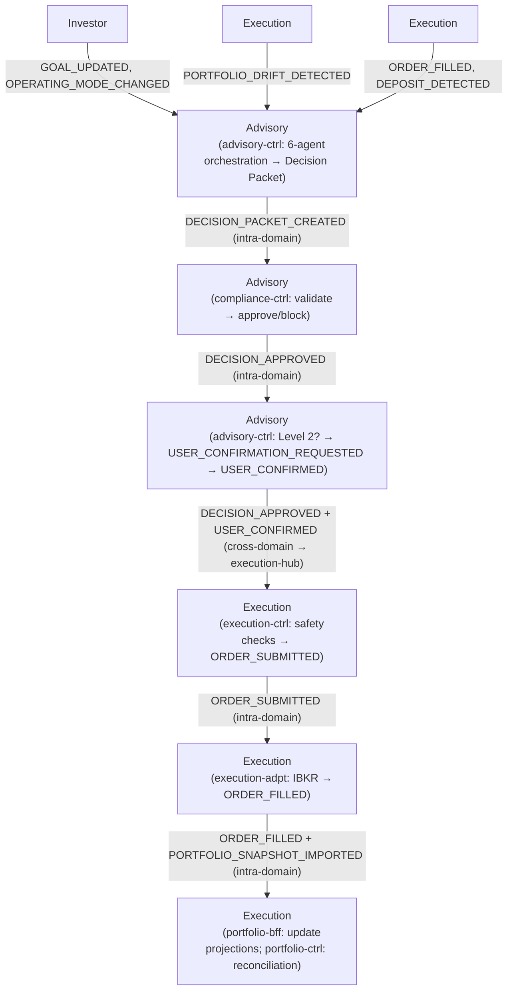
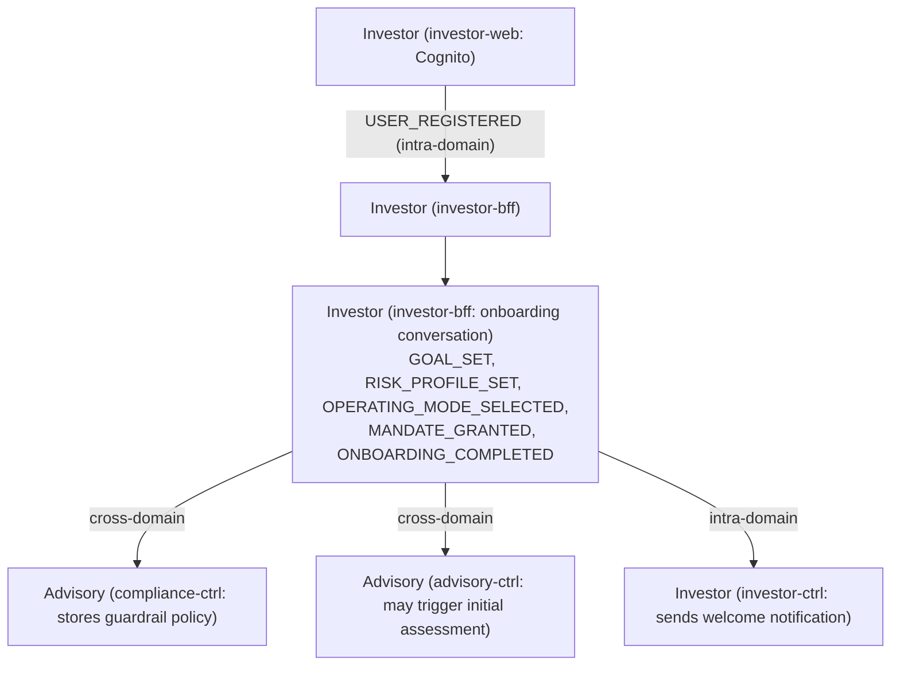
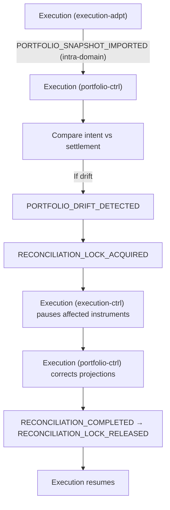
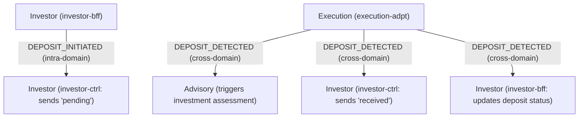
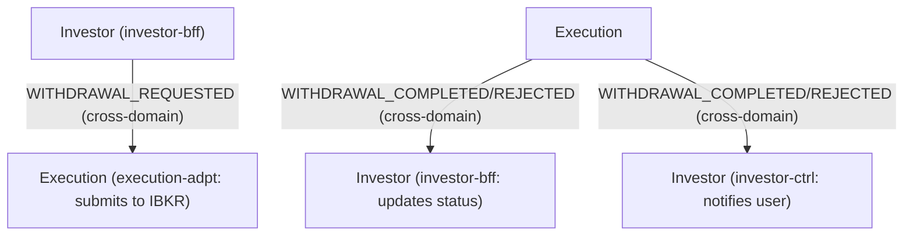
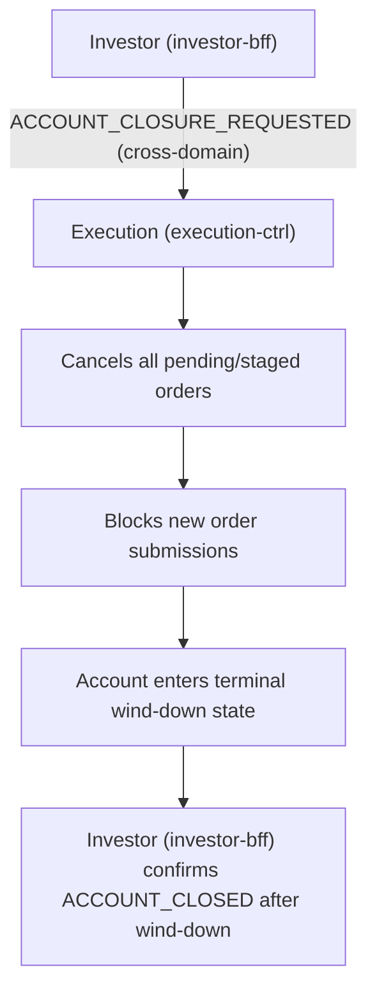
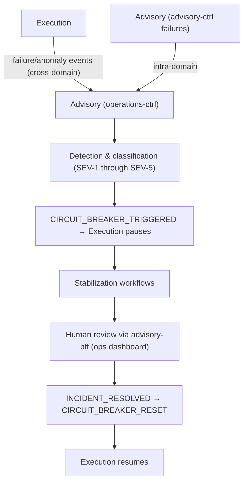

# Event Flows

Describes inter-domain event routing, the cross-domain subscription matrix, and the primary end-to-end flows that drive Nestfolio's business processes. For service-level event contracts and intra-domain subscriptions, see [Service Inventory](./service-inventory.md).

> [Back to Index](../../README.md) | [Section Overview](./README.md)

---

## Event Hub Topology

Each domain operates its own EventBridge bus, acting as the single event hub for all services within that domain:

| Event Hub | Sub-Capabilities Served | Bus |
|---|---|---|
| `investor-hub` | Identity, investor profile, notifications | Investor domain EventBridge bus |
| `advisory-hub` | AI advisory, compliance, operations | Advisory domain EventBridge bus |
| `execution-hub` | Order lifecycle, portfolio | Execution domain EventBridge bus |

Cross-domain communication is limited to **6 directional forwarding routes**, keeping inter-domain coupling minimal.

---

## Cross-Domain Forwarding Routes

| # | Direction | Purpose | Events Forwarded |
|---|---|---|---|
| 1 | Investor --> Advisory | Investor intent changes trigger advisory decisions and compliance guardrail materialization | `GOAL_UPDATED`, `RISK_PROFILE_UPDATED`, `OPERATING_MODE_CHANGED`, `MANDATE_GRANTED`, `MANDATE_UPDATED`, `MANDATE_REVOKED` |
| 2 | Investor --> Execution | Withdrawal requests and account closure flow to broker adapter | `WITHDRAWAL_REQUESTED`, `ACCOUNT_CLOSURE_REQUESTED` |
| 3 | Advisory --> Investor | Decision outcomes and operational incidents trigger notifications | `DECISION_PACKET_CREATED`, `USER_CONFIRMATION_REQUESTED`, `EXPLANATION_GENERATED`, `DECISION_APPROVED`, `DECISION_BLOCKED`, `ESCALATION_TRIGGERED`, `CIRCUIT_BREAKER_TRIGGERED`, `CIRCUIT_BREAKER_RESET`, `INCIDENT_DETECTED`, `INCIDENT_RESOLVED` |
| 4 | Advisory --> Execution | Approved decisions and circuit breaker state flow to order lifecycle | `DECISION_APPROVED`, `USER_CONFIRMED`, `CIRCUIT_BREAKER_TRIGGERED`, `CIRCUIT_BREAKER_RESET` |
| 5 | Execution --> Investor | Trade outcomes and deposit/withdrawal status trigger notifications and update request state | `ORDER_FILLED`, `ORDER_PARTIALLY_FILLED`, `ORDER_REJECTED`, `ORDER_CANCELLED`, `ORDER_STAGED`, `DEPOSIT_DETECTED`, `WITHDRAWAL_COMPLETED`, `WITHDRAWAL_REJECTED`, `CORPORATE_ACTION_APPLIED`, `RECONCILIATION_COMPLETED`, `RECONCILIATION_FAILED` |
| 6 | Execution --> Advisory | Order outcomes and portfolio drift trigger new decisions; broker failures trigger incidents | `ORDER_FILLED`, `ORDER_REJECTED`, `ORDER_CANCELLED`, `DEPOSIT_DETECTED`, `PORTFOLIO_DRIFT_DETECTED`, `BROKER_SESSION_LOST`, `STREAM_DISCONNECTED`, `RECONCILIATION_FAILED` |

---

## Cross-Domain Subscription Matrix

Rows represent consuming domains. Columns represent producing domains. Cells list events forwarded across domain boundaries.

| Consumer / Producer | Investor | Advisory | Execution |
|---|---|---|---|
| **Investor** | -- | `DECISION_PACKET_CREATED`, `USER_CONFIRMATION_REQUESTED`, `EXPLANATION_GENERATED`, `DECISION_APPROVED`, `DECISION_BLOCKED`, `ESCALATION_TRIGGERED`, `CIRCUIT_BREAKER_TRIGGERED`, `CIRCUIT_BREAKER_RESET`, `INCIDENT_DETECTED`, `INCIDENT_RESOLVED` | `ORDER_FILLED`, `ORDER_PARTIALLY_FILLED`, `ORDER_REJECTED`, `ORDER_CANCELLED`, `ORDER_STAGED`, `DEPOSIT_DETECTED`, `WITHDRAWAL_COMPLETED`, `WITHDRAWAL_REJECTED`, `CORPORATE_ACTION_APPLIED`, `RECONCILIATION_COMPLETED`, `RECONCILIATION_FAILED` |
| **Advisory** | `GOAL_UPDATED`, `RISK_PROFILE_UPDATED`, `OPERATING_MODE_CHANGED`, `MANDATE_GRANTED`, `MANDATE_UPDATED`, `MANDATE_REVOKED` | -- | `ORDER_FILLED`, `ORDER_REJECTED`, `ORDER_CANCELLED`, `DEPOSIT_DETECTED`, `PORTFOLIO_DRIFT_DETECTED`, `BROKER_SESSION_LOST`, `STREAM_DISCONNECTED`, `RECONCILIATION_FAILED` |
| **Execution** | `WITHDRAWAL_REQUESTED`, `ACCOUNT_CLOSURE_REQUESTED` | `DECISION_APPROVED`, `USER_CONFIRMED`, `CIRCUIT_BREAKER_TRIGGERED`, `CIRCUIT_BREAKER_RESET` | -- |

---

## Primary Cross-Domain Flows

### Decision Lifecycle

The core end-to-end flow from investor intent through AI-driven recommendation to trade execution.

**Trigger sources**: Investor intent changes (goal updates, operating mode changes), execution outcomes (order fills, deposits detected), portfolio drift detection.

**SAGA compensation**: On compliance block, advisory-ctrl rolls back the Decision Packet. On user rejection, the decision is archived without execution handoff.

---

### User Onboarding

---

### Reconciliation

Intra-domain flow within the Execution domain. Compares broker settlement truth against internal projection (intent truth).

Reconciliation runs on three schedules: post-execution (after every order fill), periodic (hourly, daily), and startup.

---

### Deposit Flow

Deposit detection occurs when `execution-adpt` observes a cash balance increase in a periodic IBKR snapshot import.

---

### Withdrawal Flow

**SAGA compensation**: While `WITHDRAWAL_REQUESTED` is in flight, `execution-ctrl` excludes the withdrawal amount from rebalanceable cash and blocks new rebalance orders that would overlap. If `WITHDRAWAL_REJECTED` arrives while a rebalance is queued, held cash is released back to the rebalanceable pool and the queued rebalance re-evaluates. If a rebalance is already submitted and `WITHDRAWAL_REJECTED` arrives, no compensation is needed -- the next scheduled decision cycle accounts for the restored cash position.

---

### Account Closure

---

### Incident Response

Incident triggers include broker session loss, stream disconnection, order rejection anomalies, portfolio drift detection, reconciliation failure, agent execution failure, guardrail violations, and suitability check failures.

---

## Frontend Composition

### Investor Web App (Host)

Mobile-first responsive web app (PWA candidate). Entry point: `investor-web` (CloudFront + Route53). Auth: Cognito. Locales: it-IT (primary), en-GB (secondary).

| Navigation Tab | Screen | Microfrontend Source |
|---|---|---|
| **Home** | Dashboard | Composite: `portfolio-bff` (portfolio value) + `advisory-bff` (status banner, action required) + `investor-bff` (recent activity) |
| **Portfolio** | Portfolio Detail | `portfolio-bff` (primary), `advisory-bff` (target allocation) |
| **Notifications** | Activity & Notifications | `investor-bff` |
| **Settings** | Settings & Profile | `investor-bff` (primary) + `advisory-bff` (safety rules) |
| -- | Onboarding | `investor-bff` |
| -- | Decision Detail "Why" | `advisory-bff` |
| -- | Confirmation Dialog | `advisory-bff` |
| -- | IBKR Connection | `investor-bff` |
| -- | Deposit Flow | `investor-bff` |
| -- | Withdrawal Flow | `investor-bff` |
| -- | Account Closure | `investor-bff` |
| -- | How Nestfolio Works | `investor-bff` + `advisory-bff` |
| -- | Landing / Marketing | `investor-web` (static) |
| -- | Sign Up / Sign In | `investor-web` (Cognito hosted UI) |

### Operations Dashboard (Host)

Desktop-first internal web app for Platform Operator, Compliance Reviewer, and AI Governance Reviewer.

| Section | Microfrontend Source |
|---|---|
| System Health & Incidents | `advisory-bff` |
| AI Model Registry & Promotion | `advisory-bff` |
| Shadow Comparison Reports | `advisory-bff` |
| Cost Governance | `advisory-bff` |
| Compliance Dashboard & Audit Trail | `advisory-bff` |
