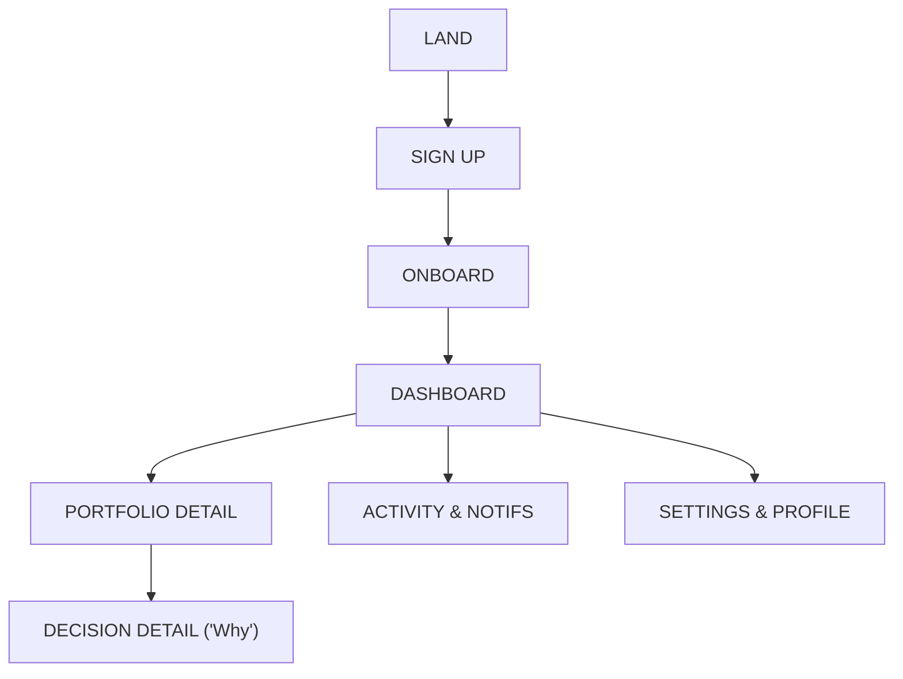

# Interaction Patterns

User flows, real-time update behavior, and microfrontend architecture strategy for Nestfolio.

> [Back to Index](../../README.md) | [Section Overview](./README.md)

---

## User Journey Map

---

## Onboarding Flow

> Wireframe: [Onboarding Conversation](../wireframes/onboarding-conversation.html)

Onboarding is a conversational flow, not a traditional form. It feels like talking to a knowledgeable friend who asks one question at a time.

### Flow Steps

**Step 1 -- Welcome**

"Ciao! Let's set up your investment plan together."

**Step 2 -- Goal Setting (1-3 questions)**

- "What are you saving for?" Options: Retirement, Rainy Day, Home, Education, Grow Wealth
- "When do you want to reach this goal?" Slider: 1 year to 30+ years
- "How much do you want to invest to start?" Amount input with sensible defaults

**Step 3 -- Account Mode**

"Would you like to start with real money or try it out first?"

- **"Try it first" (Simulation)**: Virtual capital amount picker with preset options: EUR 5,000 / 10,000 / 25,000 / 50,000 / Custom. Framed positively: "Many investors start here to build confidence. You'll see exactly how Nestfolio manages a real portfolio -- with virtual money."
- **"Start investing" (Live)**: Continues to the next step as before. No additional UI.

**Step 4 -- Risk Comfort (2-3 questions)**

- "If your portfolio dropped 10% in a month, what would you do?" Options: Sell everything, Sell some, Do nothing, Buy more
- "Which best describes your investment experience?" Options: None, A little, Some, Experienced
- Additional questions as needed for suitability compliance

**Step 5 -- Operating Mode Selection**

"How much control do you want to keep?"

| Mode | Description | Rebalance Frequency | Confirmation Threshold | Drawdown Protection |
|------|-------------|--------------------|-----------------------|--------------------|
| **Conservative** | "Check with me often" | About once per quarter | Trades above 5% of portfolio | Pauses at -8% |
| **Balanced** (recommended) | "Handle most things, ask me for big changes" | About once per month | Trades above 10% of portfolio | Pauses at -12% |
| **Aggressive** | "Manage everything, just keep me informed" | Up to twice per month | Trades above 20% of portfolio | Pauses at -18% |

Visual comparison card for each mode with plain-language guardrail summary.

**Step 6 -- Mandate & Terms**

"Here's what you're allowing Nestfolio to do for you." Summary of mandate scope in plain language, explicit consent toggle, link to full terms.

**Step 7 -- Account Activation**

Behavior branches by account mode:

- **Live mode**: "We're setting everything up for you." Nestfolio provisions and configures the brokerage account transparently behind the scenes. The user sees a progress indicator ("Creating your investment account...") and a success confirmation ("Your account is ready!"). The user never interacts with the broker directly.
- **Simulation mode**: "Your simulation portfolio is ready!" Virtual capital is credited immediately. No brokerage provisioning required. The user sees a brief confirmation ("EUR 10,000 in virtual capital has been added to your portfolio.") and proceeds directly to the next step.

**Step 8 -- Confirmation & Launch**

"You're all set! Here's your plan:" Goal summary card, risk profile summary, operating mode badge, account mode badge (Simulation or Live). [Go to Dashboard]

### Events Emitted per Step

| Step | Events |
|------|--------|
| Step 2 | `ONBOARDING_ANSWER_RECORDED` (xN), `GOAL_SET` |
| Step 3 | `ACCOUNT_MODE_SET` |
| Step 4 | `ONBOARDING_ANSWER_RECORDED` (xN), `RISK_PROFILE_SET` |
| Step 5 | `OPERATING_MODE_SELECTED` |
| Step 6 | `MANDATE_GRANTED` |
| Step 8 | `ONBOARDING_COMPLETED` |

`ONBOARDING_COMPLETED` triggers downstream processing: `advisory-ctrl` begins initial portfolio assessment, `compliance-ctrl` stores guardrail policy, `notification-ctrl` sends welcome message.

### Onboarding UX Rules

- One question per screen on mobile. Grouped on desktop where appropriate.
- Back navigation is always available. No answer is permanent during onboarding.
- Progress indicator shows steps completed (e.g., "3 of 8").
- Skip is never available -- all steps are required for suitability compliance.
- If the user abandons mid-flow, the system resumes from where they left off on next visit.

---

## Mode Change Flow

> Wireframe: [Settings & Profile](../wireframes/09-settings.html)

Changing the operating mode is a Level 2 action.

1. User taps current mode in Settings -> side-by-side comparison of all three modes with both qualitative descriptions and quantitative guardrail parameters (rebalance frequency, max trade size, confirmation thresholds, cool-down periods, circuit breaker levels).
2. User selects new mode -> impact summary ("This means Nestfolio will ask for your confirmation less often" / "Rebalancing will happen more frequently").
3. System validates compatibility with risk profile via `compliance-ctrl`.
4. If compatible -> confirmation dialog with explicit consent.
5. `OPERATING_MODE_CHANGED` emitted -> guardrail policy updated across all domains.

---

## Deposit Flow

> Wireframe: [Deposit & Withdrawal](../wireframes/11-deposit-withdrawal.html)

Deposits are Level 3 (user-exclusive) actions. Nestfolio facilitates but does not initiate them.

### Steps

1. **Initiate**: User taps "Add funds" (from Portfolio Detail or Settings). Shows bank transfer instructions for their investment account. Reference number and amount input. "Funds typically arrive in 1-3 business days."
2. **Pending**: `DEPOSIT_INITIATED` emitted. Dashboard shows "Deposit pending" status. Notification: "We'll let you know when your deposit arrives."
3. **Detected**: `execution-adpt` detects new cash via IBKR snapshot diff (Live) or immediate virtual balance update (Simulation). `DEPOSIT_DETECTED` emitted. Dashboard: "Deposit of EUR 500 received." Notification: "Deposit received -- we're evaluating how to invest it."
4. **Investment**: `advisory-ctrl` triggers portfolio assessment for new cash. Normal decision lifecycle: construction -> compliance -> execution. Decision Detail shows: "We invested your new deposit."

### Simulation Deposit Variant

When `account_mode = SIMULATION`, deposits use virtual capital and are instantaneous. No bank transfer or waiting period.

1. **Initiate**: User taps "Add virtual funds" (from Portfolio Detail or Settings). Amount input with virtual capital balance shown. "Virtual funds are credited instantly."
2. **Credit**: Virtual capital is added immediately. `VIRTUAL_DEPOSIT_CREDITED` emitted. Dashboard: "Virtual deposit of EUR 500 received." Notification: "Virtual deposit received -- we're evaluating how to invest it."
3. **Investment**: `advisory-ctrl` triggers the same portfolio assessment as a live deposit. Normal decision lifecycle applies. Decision Detail shows: "We invested your virtual deposit."

---

## Withdrawal Flow

> Wireframe: [Deposit & Withdrawal](../wireframes/11-deposit-withdrawal.html)

Withdrawals are Level 3 (user-exclusive) actions.

### Steps

1. **Request**: User taps "Withdraw funds" (from Settings -> Deposits & Withdrawals). Amount input with available cash shown. Warning if positions must be sold: "To withdraw EUR X, we may need to sell some holdings. Nestfolio will choose the most tax-efficient way to free up the funds." Confirmation: "Withdraw EUR X."
2. **Processing**: `WITHDRAWAL_REQUESTED` emitted. If positions must be sold: `advisory-ctrl` triggers liquidation plan. `execution-adpt` submits withdrawal to IBKR (Live) or simulation engine (Simulation) -> `WITHDRAWAL_SUBMITTED`. Status shown in Settings and Dashboard: "Withdrawal processing."
3. **Outcome**: `WITHDRAWAL_COMPLETED` -> "Your withdrawal of EUR X has been processed." OR `WITHDRAWAL_REJECTED` -> "Withdrawal could not be processed: [reason]."

### Withdrawal Recommendation

The advisory system may recommend a withdrawal (Level 2). This appears as a Confirmation Dialog variant:

- Copy: "Based on your goal timeline, we recommend withdrawing EUR X to [reason]."
- User confirms or declines.
- If confirmed, enters the standard withdrawal execution flow.

### Simulation Withdrawal Variant

When `account_mode = SIMULATION`, withdrawals use virtual capital and are instantaneous. No real fund movement.

1. **Request**: User taps "Withdraw virtual funds" (from Settings -> Deposits & Withdrawals). Amount input with available virtual cash shown. Same warning logic applies if simulated positions must be sold: "To withdraw EUR X, we may need to sell some virtual holdings. Nestfolio will choose the most tax-efficient way to free up the funds."
2. **Debit**: Virtual capital is debited immediately. `VIRTUAL_WITHDRAWAL_DEBITED` emitted. If positions must be sold, `advisory-ctrl` triggers the same liquidation logic as a live withdrawal. Status: "Virtual withdrawal of EUR X processed."

### Deposits and Withdrawals in Portfolio Activity

| Action | Icon | Copy |
|--------|------|------|
| Deposit received | Down arrow | "Deposit: EUR 500 received" |
| Deposit invested | Filled circle | "New funds invested across 3 positions" |
| Withdrawal requested | Up arrow | "Withdrawal: EUR 1,000 requested" |
| Withdrawal completed | Up arrow | "Withdrawal: EUR 1,000 processed" |

---

## Account Closure and Deletion

> Wireframe: [Account Closure & GDPR](../wireframes/13-account-closure.html)

### Account Closure

1. User taps "Close my account" -> multi-step confirmation:
   - Step 1: "This will stop all portfolio management."
   - Step 2: "Your mandate will be revoked and your investment account will be closed."
   - Step 3: Explicit "I understand, close my account" confirmation.
2. `ACCOUNT_CLOSURE_REQUESTED` -> mandate revoked -> broker authorization revoked internally -> execution halted.
3. `ACCOUNT_CLOSED` emitted. Portfolio visible in read-only mode. Welcome-back flow available.

### GDPR Data Deletion

1. User taps "Delete my data" -> explanation:
   - "We will delete your personal data. Some anonymized financial records are kept for regulatory compliance (up to 10 years)."
   - Data retention summary: PII deleted immediately, operational data retained 5 years (anonymized), financial records 10+ years (anonymized).
2. Requires account closure first if the account is active.
3. `USER_DELETION_REQUESTED` -> PII removed -> audit data anonymized.

---

## Mandate Revocation

1. User taps "Revoke mandate" -> warning: "Nestfolio will stop managing your portfolio. Your current holdings will remain in your investment account."
2. Confirmation required.
3. `MANDATE_REVOKED` emitted -> execution halted -> user notified.
4. Portfolio remains visible in read-only mode. Re-onboarding possible.

---

## Simulation-to-Live Transition Flow

Users in simulation mode can upgrade to a live account at any time from Settings -> Account Mode -> "Go Live".

### Steps

1. **Impact Summary**: "Going live means your simulation portfolio will be reset and you'll start fresh with real money." Clear summary of what is preserved (goals, risk profile, operating mode, mandate) and what is reset (portfolio positions, virtual capital balance, simulated trade history).
2. **Confirmation**: Level 2 confirmation with press-and-hold: "I understand. Go live." Copy: "This cannot be undone. Your simulation data will no longer be accessible."
3. **Account Provisioning**: Same as live onboarding Step 7 -- Nestfolio provisions and configures the brokerage account transparently behind the scenes. Progress indicator: "Creating your live investment account..."
4. **Portfolio Reset**: Simulation positions and virtual capital are cleared. `ACCOUNT_MODE_SET` (mode: LIVE) emitted. All downstream services update accordingly.
5. **Completion & Deposit Prompt**: "Your live account is ready!" Prompt to make a first deposit: "Add funds to start investing with real money." Links to the Deposit Flow.

### Events

| Step | Events |
|------|--------|
| Step 2 | `GO_LIVE_REQUESTED`, `ACCOUNT_MODE_SET` (mode: LIVE) |
| Step 4 | `PORTFOLIO_RESET_COMPLETED` |
| Step 5 | `GO_LIVE_COMPLETED` |

---

## Notification Timing Preferences

> Wireframe: [Settings & Profile](../wireframes/09-settings.html)

A sub-screen within Settings -> Notifications.

| Timing Mode | Description | Example |
|-------------|-------------|---------|
| **Post-Fact** (default for Aggressive) | "We'll tell you after we act" | Rebalance notification arrives after trades complete |
| **Pre-Intent** | "We'll tell you before we act, with a short window to say 'wait'" | Soft pre-notice arrives before autonomous execution |
| **Hybrid** (default for Conservative, Balanced) | "We'll choose the right timing based on the importance of each action" | Small rebalances notified post-fact; large ones get pre-notice |

Copy: "This controls when you hear about autonomous actions. It does not affect actions that require your confirmation -- those always ask first."

Per-channel toggles for each notification severity tier (push on/off, email on/off).

---

## Broker Connection Status (Internal)

The brokerage connection is managed entirely by Nestfolio behind the scenes. The user never interacts with the broker directly -- no OAuth redirects, no broker login pages, no manual reconnection. Nestfolio provisions, authorizes, and maintains the brokerage account on the user's behalf.

- **No user-facing broker screen** in Settings or elsewhere.
- Session management, token refresh, and reconnection are handled automatically by `execution-adpt`.
- If the broker connection is lost, the system recovers silently. The user is only notified if execution is paused for an extended period (via a Critical notification: "We're experiencing a temporary issue with trading. We're working on it.")
- Account closure and mandate revocation trigger broker authorization cleanup internally.

---

## Real-Time Updates

### Live Subscriptions

The following screens use AppSync GraphQL subscriptions for real-time data.

| Screen | Subscription | Trigger Event |
|--------|-------------|---------------|
| Dashboard -- portfolio value | Position update | `POSITION_UPDATED`, `CASH_BALANCE_UPDATED` |
| Dashboard -- notifications | New notification | `NOTIFICATION_CREATED` |
| Dashboard -- action required | Confirmation request | `USER_CONFIRMATION_REQUESTED` |
| Portfolio Detail -- positions | Position changes | `POSITION_UPDATED` |
| Notifications -- inbox | New messages | `NOTIFICATION_CREATED` |

### Update Behavior

- Real-time updates are applied silently (no flash/reload).
- Portfolio value changes animate smoothly (number counter).
- New notifications appear at the top of the list with a subtle highlight that fades after 3 seconds.
- If a confirmation request arrives while the user is on the dashboard, the "Action Required" card slides in.

---

## Monthly Report

### Content

A periodic summary delivered in-app and via email:

- Portfolio performance for the period (absolute and %)
- Actions taken by Nestfolio (count and summary)
- Goal progress update
- Key decisions and their reasoning (links to Decision Detail)
- Upcoming outlook (plain-language, non-predictive)

### Delivery

- Triggered by `MONTHLY_REPORT_GENERATED` event from `notification-ctrl`.
- Report data assembled from `portfolio-bff` and `advisory-bff` projections.
- In-app: scrollable card-based layout with a "Download PDF" button for offline record-keeping, tax preparation, and advisor sharing.
- Email: HTML email with summary and "View full report in Nestfolio" CTA.
- PDF: Generated server-side on demand. Includes all report sections in a print-optimized layout with Nestfolio branding.

---

## Microfrontend Strategy

Each BFF service owns a microfrontend hosted in its S3 bucket (part of the Facade construct). The `portfolio-web` service provides the shell application and CloudFront distribution.

### Architecture

| Component | Responsibility | Hosting |
|-----------|---------------|---------|
| Shell application | Navigation, authentication, layout chrome | `portfolio-web` CloudFront |
| Dashboard microfrontend | Home screen, portfolio summary, status | `portfolio-bff` S3 bucket |
| Advisory microfrontend | Decision Detail, Confirmation Dialog | `advisory-bff` S3 bucket |
| Notification microfrontend | Activity feed, notification preferences | `notification-bff` S3 bucket |
| Identity microfrontend | Onboarding, Settings, Profile | `identity-bff` S3 bucket |

### Integration

- CloudFront path-based routing directs requests to the correct BFF's S3 origin.
- The shell application loads microfrontends dynamically.
- Shared design tokens and component library are published as an Nx library (`libs/ui-components`).
- Each microfrontend communicates with its own BFF's GraphQL API. Cross-BFF data is resolved via subscriptions, not direct calls.
