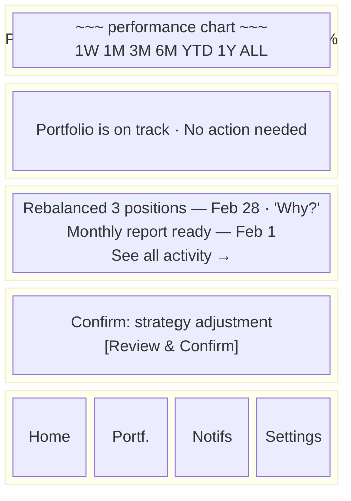

# Screen Inventory

Complete screen specifications mapped to bounded contexts and BFF services, responsive layouts, breakpoints, and component specifications.

> [Back to Index](../../README.md) | [Section Overview](./README.md)

---

## Screen Map

| # | Screen | BFF Service(s) | GraphQL Operations | Primary Content |
|---|--------|----------------|--------------------|-----------------|
| 1 | Landing / Marketing | `identity-web` | -- | Value proposition, trust signals, CTA |
| 2 | Sign Up / Sign In | `identity-web` | Cognito federation (Google, Facebook, email) | Authentication |
| 3 | Onboarding Conversation | `identity-bff` | `recordOnboardingAnswer`, `setGoal`, `setRiskProfile`, `selectOperatingMode`, `grantMandate` | Guided Q&A |
| 4 | Dashboard (Home) | `portfolio-bff`, `advisory-bff`, `notification-bff` | `getPortfolioSummary`, `getRecommendations`, `getUnreadCount` | Portfolio health, recent activity, nudges |
| 5 | Portfolio Detail | `portfolio-bff`, `advisory-bff`, `identity-bff` | `getPositions`, `getCashBalances`, `getPerformanceChart` | Holdings, allocation, performance |
| 6 | Decision Detail ("Why") | `advisory-bff`, `compliance-bff` | `getExplanation`, `getRecommendation` | Plain-language reasoning for a specific action |
| 7 | Activity & Notifications | `notification-bff` | `getNotifications`, `markAsRead` | Notification inbox, history |
| 8 | Confirmation Dialog | `advisory-bff` | `confirmDecision`, `rejectDecision` | Level 2 user confirmation |
| 9 | Settings & Profile | `identity-bff`, `compliance-bff`, `notification-bff` | `getProfile`, `updateGoal`, `updateOperatingMode`, `updateMandate` | Goals, risk profile, mode, preferences |
| 10 | *(Removed -- broker is fully transparent to user)* | -- | -- | -- |
| 11 | Deposit Flow | `identity-bff` | `initiateDeposit` | Bank transfer instructions, deposit status |
| 12 | Withdrawal Flow | `identity-bff` | `requestWithdrawal` | Withdrawal amount, confirmation, status |
| 13 | Account Closure & Deletion | `identity-bff` | `requestAccountClosure`, `requestDeletion` | Closure confirmation, GDPR deletion, data retention |
| 14 | How Nestfolio Works | `identity-bff`, `compliance-bff` | `getProfile`, `getGuardrailSummary` | Goals, mode, mandate scope, safety rules, authority levels |

---

## Bounded Context to Screen Mapping

| UI Surface | Bounded Context(s) | BFF(s) | Key Events Consumed/Produced |
|------------|-------------------|--------|------------------------------|
| Onboarding | Identity | `identity-bff` | Produces: `ONBOARDING_ANSWER_RECORDED`, `GOAL_SET`, `RISK_PROFILE_SET`, `OPERATING_MODE_SELECTED`, `MANDATE_GRANTED`, `ONBOARDING_COMPLETED` |
| Dashboard | Portfolio, Advisory, Notification, Operations | `portfolio-bff`, `advisory-bff`, `notification-bff` | Consumes: position/cash projections, recommendations, notifications, health check status |
| Portfolio Detail | Portfolio, Advisory, Identity | `portfolio-bff`, `advisory-bff`, `identity-bff` | Consumes: positions, cash balances, performance data, target allocation, goal data |
| Decision Detail | Advisory, Compliance | `advisory-bff`, `compliance-bff` | Consumes: explanations, recommendations, compliance audit. Produces: `USER_VIEWED_EXPLANATION` |
| Confirmation | Advisory, Compliance | `advisory-bff` | Consumes: `USER_CONFIRMATION_REQUESTED`. Produces: `USER_CONFIRMED` or `USER_REJECTED` |
| Notifications | Notification | `notification-bff` | Consumes: all notification types. Produces: `NOTIFICATION_READ` |
| Settings | Identity, Compliance, Notification | `identity-bff`, `compliance-bff`, `notification-bff` | Produces: `GOAL_UPDATED`, `OPERATING_MODE_CHANGED`, `MANDATE_UPDATED`, `MANDATE_REVOKED` |
| Deposit Flow | Identity, Execution | `identity-bff` | Produces: `DEPOSIT_INITIATED`. Consumes: `DEPOSIT_DETECTED` |
| Withdrawal Flow | Identity, Execution | `identity-bff` | Produces: `WITHDRAWAL_REQUESTED`. Consumes: `WITHDRAWAL_COMPLETED`, `WITHDRAWAL_REJECTED` |
| Account Closure | Identity, Execution | `identity-bff` | Produces: `ACCOUNT_CLOSURE_REQUESTED`, `USER_DELETION_REQUESTED`, `MANDATE_REVOKED`, `ACCOUNT_CLOSED` |
| How Nestfolio Works | Identity, Compliance | `identity-bff`, `compliance-bff` | Consumes: profile, guardrail policy, audit summary |

---

## Dashboard (Home Screen)

**Design intent**: Answer the single question "Is my money OK?" Everything else is secondary.

### Layout



### Sections

| Section | Data Source | Behavior |
|---------|-----------|----------|
| **Portfolio Value** | `portfolio-bff` -> `getPortfolioSummary` | Total value, change %, sparkline chart. Tap opens Portfolio Detail. |
| **Status Banner** | `advisory-bff` -> `getRecommendations` | One-sentence system state summary. Green/amber/red sentiment. |
| **Recent Activity** | `notification-bff` -> `getNotifications(limit: 3)` | Last 3 notifications. Each links to Decision Detail ("Why?") or notification detail. |
| **Action Required** | `advisory-bff` -> pending `USER_CONFIRMATION_REQUESTED` | Appears only when Level 2 confirmation is needed. Tap opens Confirmation Dialog. |

### Trust Signals

- Status banner defaults to positive framing: "Portfolio is on track" / "No action needed".
- Autonomous actions show: "We handled this -- tap to see why."
- Portfolio value change is shown in context (vs. goal progress) to avoid panic on red days.
- "Last health check: today" indicator reinforces active monitoring (from `HEALTH_CHECK_COMPLETED` events).
- Deposits show: "New deposit received -- we're evaluating how to invest it."
- Staged orders show: "Trade scheduled for next market open."

---

## Portfolio Detail

**Design intent**: For users who want to look deeper. Shows what is in the portfolio and how it is performing. Never demands action.

### Content Tabs

| Tab | Content | Source |
|-----|---------|--------|
| **Overview** | Total value, cash balance, allocation donut chart (actual vs target overlay), goal progress section, risk band gauge | `portfolio-bff`, `identity-bff` (goal data), `advisory-bff` (target allocation) |
| **Holdings** | Position list: instrument name, quantity, current value, gain/loss %, weight %, target weight % | `portfolio-bff` -> `getPositions` |
| **Performance** | Time-series chart with period selectors (1W, 1M, 3M, 6M, YTD, 1Y, ALL), comparison against goal target line, projected completion date | `portfolio-bff` -> `getPerformanceChart` |
| **Activity** | Chronological list of trades, rebalances, deposits, withdrawals, corporate actions, dividend reinvestments. Each links to Decision Detail. Distinct icons per action type. | `notification-bff`, `advisory-bff` |

### Interaction Details

- **Tap a holding**: Expands to show instrument description, why it is in the portfolio (link to most recent relevant Decision Detail), current weight vs target weight, last action taken.
- **Allocation donut chart**: Shows actual allocation with target allocation as a ghost ring overlay. Tappable segments highlight the corresponding holding.
- **Risk band gauge**: Visual meter showing portfolio position within its allowed risk range. Green zone = within band, amber = approaching edge. Tap shows plain-language explanation.
- **Goal progress section**: Progress bar (actual vs target trajectory), projected completion date, runway summary ("X months ahead of schedule" / "Y months behind -- Nestfolio is optimizing").

### Copy Guidelines

- Instrument names use common names, not ticker symbols (e.g., "Global Stocks ETF" not "VWCE.DE"). Ticker shown as secondary text.
- Gains shown in absolute and percentage terms. Losses use neutral language ("down 2.1%" not "lost EUR 510").
- No buy/sell buttons. The UI reinforces this with copy: "Managed by Nestfolio."
- "Last updated: 2 min ago" timestamp at the bottom of the Overview tab.

---

## Decision Detail ("Why" View)

**Design intent**: The core trust-building screen. Progressive disclosure of what happened and why.

### Content Layers

| Layer | Content | Source |
|-------|---------|--------|
| **Headline** | One-sentence action summary | `advisory-bff` -> `getExplanation` -> `narrative` |
| **Why** | 2-3 sentence plain-language reasoning | `advisory-bff` -> `getExplanation` -> `reasoningFactors` |
| **Market Context** | Market conditions that influenced the decision | `advisory-bff` -> market-related reasoning factors |
| **Reasoning Factors** | Structured list: drift magnitude, risk band compliance, goal horizon, expected improvement, cool-down status | `advisory-bff` -> `getExplanation` -> `reasoningFactors` (raw) |
| **Risk Impact** | Pre/post risk band position as visual gauge | Decision Packet `riskChecks` via `advisory-bff` |
| **Trades Executed** | Instrument, side, quantity, price, status (submitted / accepted / partially filled / filled / staged / rejected / cancelled) | `portfolio-bff` / `advisory-bff` -> Decision Packet |
| **Cost & Impact** | Estimated fees, slippage, tax impact, monthly turnover consumed | Decision Packet `cost_checks` |
| **Compliance** | Pass/fail badge, authority level, mandate scope invoked, escalation reason if Level 2 | `compliance-bff` audit projection |

### Decision Detail Variants

| Action Type | Headline Pattern | Extra Content |
|-------------|-----------------|---------------|
| Rebalance | "We rebalanced your portfolio..." | Drift magnitude, target vs actual allocation |
| Dividend reinvestment | "We reinvested your dividend..." | Dividend source, reinvestment instrument |
| Tax-efficient adjustment | "We made a tax-efficient swap..." | Tax savings estimate, replacement rationale |
| Deposit investment | "We invested your new deposit..." | Deposit amount, allocation decisions |
| Corporate action | "A corporate action affected your portfolio..." | Action type, impact on holdings |
| Blocked decision | "We considered a change but didn't proceed..." | Reason for block, which safety rule prevented it |

### UX Rules

- Headline and "Why" section are always visible without scrolling.
- Detail sections are collapsed by default.
- Every detail section uses plain language with contextual glossary tooltips.
- `decision_id` and model version shown as small references at the bottom for support/audit purposes.
- `USER_VIEWED_EXPLANATION` event emitted when this screen is opened.
- In-flight orders show live status with subtle animation.

---

## Confirmation Dialog (Level 2)

### Triggers

The system requests user confirmation for Level 2 decisions:

- Strategy or risk profile changes
- Trades exceeding mode thresholds (e.g., single trade > max trade size)
- Operating mode changes
- Mandate modifications
- Withdrawal recommendations
- Monthly turnover cap breach
- Portfolio drawdown exceeding circuit breaker threshold
- Any action escalated by compliance

### Layout

```mermaid
block-beta
    columns 1

    block:header["! YOUR CONFIRMATION IS NEEDED"]
    end

    block:proposed["PROPOSED ACTION"]
        p1["Nestfolio recommends adjusting your portfolio:\nreduce stocks by 5%, increase bonds by 5%."]
    end

    block:why["WHY THIS NEEDS YOUR OK"]
        w1["This trade is 12% of your portfolio,\nabove your Balanced mode limit of 10%.\nYour settings require your OK for changes of this size."]
    end

    block:what["WHAT WILL HAPPEN"]
        wh1["Sell: Global Stocks ETF (EUR 1,200)\nBuy: Euro Bonds ETF (EUR 1,200)\nEstimated fees: EUR 2.40\nEstimated tax impact: EUR 0\nTurnover: 8% of 25% monthly limit"]
    end

    block:expand
        e1["> Full reasoning (expandable)"]
    end

    block:buttons
        decline["Decline"] confirm["Confirm"]
    end

    block:expiry
        exp["Expires in: 48h"]
    end
```

### Behavior

| Action | Event Emitted | Result |
|--------|--------------|--------|
| **Confirm** | `USER_CONFIRMED` | Execution proceeds. Success notification shown. |
| **Decline** | `USER_REJECTED` | Decision cancelled. Optional reason. System acknowledges gracefully. |
| **Expiry** | `USER_REJECTED` (auto, reason: "expired") | Decision cancelled. User notified. |

### UX Rules

- Appears as both an in-app banner (Dashboard) and a push notification.
- "Confirm" button is prominent but not the default action. No accidental confirmations.
- Expiry timer varies by mode: Conservative 72h, Balanced 48h, Aggressive 24h.
- Declining is frictionless and judgment-free. Copy: "No problem -- we won't make this change."
- Confirmation outside market hours shows: "This trade will be submitted when markets open on Monday." Order enters `Staged` state.
- "Why this needs your OK" dynamically references the specific escalation rule.

---

## Activity & Notifications

### Notification Severity Tiers

| Severity | Examples | Tappable Destination |
|----------|---------|---------------------|
| **Informational** | "Monthly report is ready", "Weekly health check complete", "Model updated" | Report view / Dashboard |
| **Advisory** | "New recommendation available", "Corporate action applied", "Deposit received" | Decision Detail |
| **Impactful** (soft pre-notice) | "Upcoming: rebalance planned for tomorrow", "Large rebalance completed", "Dividend reinvested" | Decision Detail |
| **Confirmable** | "Your confirmation is needed: strategy adjustment" | Confirmation Dialog |
| **Critical** | "Trading paused due to market volatility", "Trading service disruption", "Order partially filled" | Status detail / Decision Detail |

### Specific Notification Templates

| Event Source | Notification Copy | Severity |
|-------------|-------------------|----------|
| `DECISION_BLOCKED` | "We considered a portfolio change but our safety rules determined it wasn't appropriate right now." | Advisory |
| `ORDER_PARTIALLY_FILLED` | "A trade was partially completed. We're monitoring the remaining portion." | Critical |
| `ORDER_CANCELLED` | "A trade was cancelled. Tap to see why." | Advisory |
| `ORDER_REJECTED` | "A trade could not be completed. [Specific reason]" | Critical |
| `ORDER_STAGED` | "Your trade is scheduled for when markets open." | Informational |
| `CORPORATE_ACTION_APPLIED` | "A corporate action affected your holdings: [action type] on [instrument]." | Advisory |
| `DEPOSIT_DETECTED` | "Deposit of EUR [amount] received -- we're evaluating how to invest it." | Advisory |
| `WITHDRAWAL_COMPLETED` | "Your withdrawal of EUR [amount] has been processed." | Informational |
| `WITHDRAWAL_REJECTED` | "Your withdrawal could not be processed: [reason]." | Critical |
| `RECONCILIATION_COMPLETED` | "Portfolio verification complete -- everything matches." | Informational |
| `RECONCILIATION_FAILED` | "We're having trouble verifying your portfolio. Our team is looking into it." | Critical |
| `INCIDENT_RESOLVED` | "Trading has resumed. Everything is back to normal." | Informational |
| `CIRCUIT_BREAKER_RESET` | "Market conditions have stabilized. Your safety rules are no longer pausing trades." | Informational |

### Layout

- Unread count badge on the bottom nav "Notifications" tab.
- List view grouped by date. Each item shows: icon, title, subtitle (time ago), unread dot.
- Tapping marks as read (`NOTIFICATION_READ` event). Bulk "mark all as read" available.
- Empty state: "You're all caught up. Nestfolio is working quietly in the background."

### Push Notification Delivery

Delivered via push for:

- Level 2 confirmation requests (always)
- Critical alerts (always)
- Autonomous action summaries (configurable)
- Monthly reports (configurable)

Users configure push preferences in Settings.

---

## Settings & Profile

| Section | Content | Editable | BFF |
|---------|---------|----------|-----|
| **Profile** | Name, email, federation provider | Read-only (Cognito-managed) | `identity-bff` |
| **Investment Goal** | Goal type, target amount, time horizon | Yes | `identity-bff` -> `updateGoal` |
| **Risk Profile** | Risk comfort summary, risk band | Re-take questionnaire | `identity-bff` |
| **Operating Mode** | Current mode, description, guardrail summary, change option | Yes (Level 2) | `identity-bff` -> `updateOperatingMode` |
| **Your Safety Rules** | Expandable panel with simplified guardrail parameters | Read-only (changes with mode) | `compliance-bff` -> `getGuardrailSummary` |
| **Mandate** | Plain-language summary of what Nestfolio can do | Revocable | `identity-bff` -> `updateMandate` |
| **Notifications** | Channel preferences (push/email per type), timing mode, email frequency | Yes | `notification-bff` |
| **Deposits & Withdrawals** | Initiate deposit, request withdrawal | Action flows | `identity-bff` |
| **Language** | Interface language selection | Yes | Client-side (i18n) |
| **Model Updates** | Changelog of allocation model version updates | Read-only | `advisory-bff` |
| **Legal & Privacy** | Terms, privacy policy, mandate document, data retention summary | Read-only | Static |
| **Account** | Account deletion (GDPR), account closure | Action: close / delete | `identity-bff` |
| **How Nestfolio Works** | Link to educational overview | Read-only | -- |
| **Support** | Contact, FAQ link | Read-only | Static |

### Safety Rules Panel

An expandable panel within Operating Mode showing simplified guardrail parameters:

| Parameter | Copy Example (Balanced mode) |
|-----------|------------------------------|
| Rebalance frequency | "About once per month" |
| Max single trade | "Up to 10% of your portfolio" |
| Monthly turnover limit | "Up to 25% of portfolio value per month" |
| Concentration limit | "No single ETF above 30% of portfolio" |
| Cool-down period | "5 trading days between trades on the same instrument" |
| Drawdown protection | "Trading pauses if portfolio drops more than 12%" |
| Volatility protection | "Trading pauses during moderate market turbulence" |

Copy: "These rules protect your portfolio. They adjust automatically when you change your operating mode."

### Data Retention Summary (Legal & Privacy)

| Data Type | Retention | After Deletion |
|-----------|-----------|----------------|
| Personal information | Until you delete | Removed immediately |
| Portfolio decisions | 5 years | Anonymized |
| Financial records | 10+ years (regulatory) | Anonymized |

---

## How Nestfolio Works (Educational Screen)

A trust-building screen tying together the mandate, authority levels, operating mode, and safety rules. Accessible from Settings and Dashboard.

### Content Sections

| Section | Content | Source |
|---------|---------|--------|
| Your Goals | Goal type, target amount, target date | `identity-bff` -> `getProfile` |
| Your Risk Profile | Risk tolerance summary | `identity-bff` -> `getProfile` |
| Your Operating Mode | Mode name, description, change link | `identity-bff` -> `getProfile` |
| What Nestfolio Can Do Automatically | Rebalance, reinvest dividends, tax-efficient swaps, respond to market changes | Derived from mode + authority levels |
| What Requires Your OK | Trades above threshold, strategy changes, withdrawal recommendations | Derived from mode + authority levels |
| What Only You Can Do | Add/withdraw funds, close account | Static per authority level definitions |
| Your Safety Rules | Full guardrail parameter list | `compliance-bff` -> `getGuardrailSummary` |
| Compliance Summary | Decision count within mandate, audit history link | `compliance-bff` aggregate projection |

---

## Responsive Breakpoints

| Breakpoint | Target | Layout Adaptation |
|------------|--------|-------------------|
| < 640px | Mobile (primary) | Single column, bottom tab bar, one question per screen in onboarding |
| 640px - 1024px | Tablet | Two-column where appropriate, bottom tab bar |
| > 1024px | Desktop | Widened single-column with sidebar navigation, grouped onboarding questions |

The mobile layout is the canonical design. Tablet and desktop widen and rearrange, but never add features or screens absent from mobile.

---

## Navigation Structure

### Bottom Tab Bar (Mobile)

| Tab | Icon | Screen | Badge |
|-----|------|--------|-------|
| **Home** | House | Dashboard | -- |
| **Portfolio** | Pie chart | Portfolio Detail | -- |
| **Notifications** | Bell | Activity & Notifications | Unread count |
| **Settings** | Gear | Settings & Profile | -- |

### Navigation Principles

- **Flat hierarchy**: All primary screens are one tap from the tab bar.
- **Contextual depth**: Decision Detail and Confirmation Dialog are pushed onto the stack from any entry point.
- **Deep linking**: Push notifications and emails deep-link to the relevant Decision Detail or Confirmation Dialog.
- **Back always works**: Hardware/software back button returns to previous screen. No dead ends.
